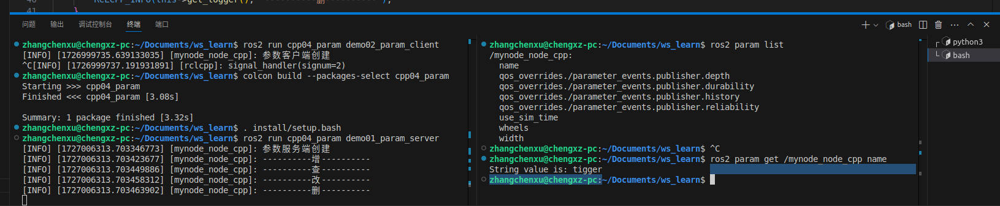
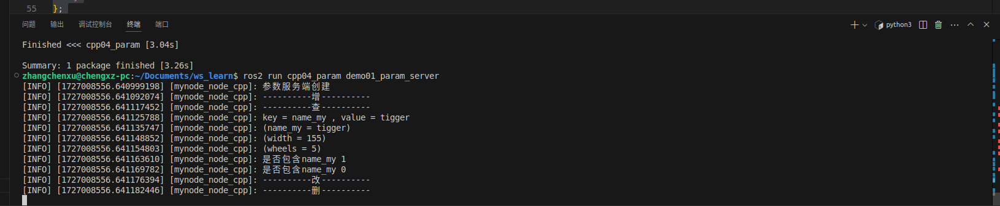
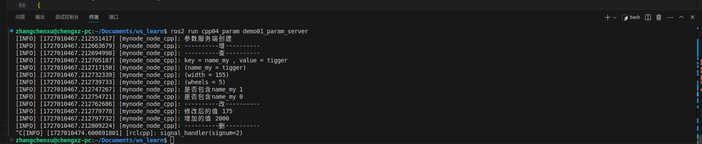
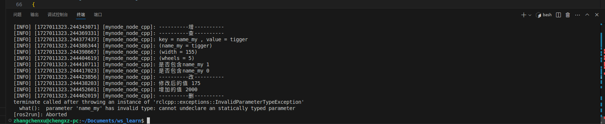
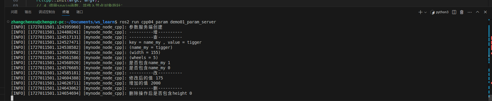

# 三、案例复现(猛狮集训营)

> 演示参数的声明、查询、修改与删除，以及参数客户端和服务端的协作方式。

[← 返回总目录](../../README.md) · [↑ 返回本章目录](README.md) · [← 上一节：3-1 话题通信](01-topic-communication.md) · [下一节：3-5 坐标变换 →](05-coordinate-transforms.md)

---

## 3-4 参数服务

### 3-4-1 概念

在一个节点下保存数据，其他节点可以访问并操作这些数据。

**概念**

参数服务是以共享的方式实现不同节点之间数据交互的一种通信模式。保存参数的节点称之为参数服务端，调用参数的节点称之为参数客户端。参数客户端与参数服务端的交互是基于请求响应的，且参数通信的实现本质是对服务通信的进一步封装。 

**作用**

类似于编程中**全局变量**的概念，可以在不停节点之间共享数据。

**参数数据类型**

参数由键、值和描述符三部分组成，其中键是字符串类型，值可以是 bool、int64、float64、string、byte[]、bool[]、int64[]、float64[]、string[]中的任一类型，描述符默认情况下为空，但是可以设置参数描述、参数数据类型、取值范围或其他约束等信息。

### 3-4-2 案例实现（增、查、改、删）

**服务端**

在src目录下创建功能包

```bash
ros2 pkg create cpp04_param --build-type ament_cmake --dependencies rclcpp --node-name demo00_param
```

实例：

**增加：**

```cpp
// 需求 创建参数服务端并操作参数
// 3-1 增
// 3-2 查
// 3-3 改
// 3-4 删
// 1.包含头文件
#include "rclcpp/rclcpp.hpp"

// 3.自定义节点类；
class Mynode : public rclcpp::Node
{
public:
    // 如果允许删除参数，需要通过 NodeOptions 声明
    Mynode() : Node("mynode_node_cpp", rclcpp::NodeOptions().allow_undeclared_parameters(true))
    {
        RCLCPP_INFO(this->get_logger(), "参数服务端创建");
        // 一个普通的节点就可以作为一个参数服务端存在
    }
    // 3-1 增
    void declare()
    {
        RCLCPP_INFO(this->get_logger(), "----------增----------");
        this->declare_parameter("name","tigger");
        this->declare_parameter("width",155);
        this->declare_parameter("wheels",5);
    }
    // 3-2 查
    void get()
    {
        RCLCPP_INFO(this->get_logger(), "----------查----------");
    }
    // 3-3 改
    void updata()
    {
        RCLCPP_INFO(this->get_logger(), "----------改----------");
    }
    // 3-4 删
    void del()
    {
        RCLCPP_INFO(this->get_logger(), "----------删----------");
    }
};

int main(int argc, char const *argv[])
{
    // 2.初始化ROS2客户端；
    rclcpp::init(argc, argv);
    // 4.调用spain函数，并传入节点对象指针；
    auto node = std::make_shared<Mynode>();
    node->declare();
    node->get();
    node->updata();
    node->del();
    rclcpp::spin(node);
    // 5.资源释放
    rclcpp::shutdown();
    return 0;
}
```

查看是否创建

```bash
ros2 param list
```

查看具体值

```bash
ros2 param get /mynode_node_cpp name
```





**查找：**

**使用 `get_parameter` 方法**：

这是获取单个参数值的方法。你可以指定参数的名称，它将返回该参数的值（如果存在）。

```cpp
rclcpp::Parameter param = this->get_parameter("param_name");
```

**使用 `get_parameter_or` 方法**：

允许你提供一个默认值。如果指定的参数不存在，它将返回默认值。

```cpp
rclcpp::Parameter param = this->get_parameter_or("param_name", rclcpp::Parameter("default_value"));
```

**使用 `get_parameters` 方法**：

这是获取多个参数的方法。你可以提供一个参数名称的列表，它将返回这些参数的值。

```cpp
std::vector<rclcpp::Parameter> params = this->get_parameters({"param1", "param2"});
```

**使用 `get_parameter_names` 方法**：

如果你想获取节点的所有参数名称，可以使用这个方法。

```cpp
std::vector<std::string> param_names = this->get_parameter_names();
```

**使用 `get_node_parameters_interface` 方法**：

需要更高级的参数接口，可以使用这个方法获取 `NodeParametersInterface`。

```cpp
auto params_interface = this->get_node_parameters_interface();
```


```cpp
// 需求 创建参数服务端并操作参数
// 3-1 增
// 3-2 查
// 3-3 改
// 3-4 删
// 1.包含头文件
#include "rclcpp/rclcpp.hpp"

// 3.自定义节点类；
class Mynode : public rclcpp::Node
{
public:
    // 如果允许删除参数，需要通过 NodeOptions 声明
    Mynode() : Node("mynode_node_cpp", rclcpp::NodeOptions().allow_undeclared_parameters(true))
    {
        RCLCPP_INFO(this->get_logger(), "参数服务端创建");
        // 一个普通的节点就可以作为一个参数服务端存在
    }
    // 3-1 增
    void declare()
    {
        RCLCPP_INFO(this->get_logger(), "----------增----------");
        this->declare_parameter("name_my", "tigger");
        this->declare_parameter("width", 155);
        this->declare_parameter("wheels", 5);
    }
    // 3-2 查
    void get()
    {
        RCLCPP_INFO(this->get_logger(), "----------查----------");
        // 获取指定参数
        auto na = this->get_parameter("name_my");
        RCLCPP_INFO(this->get_logger(), "key = %s , value = %s", na.get_name().c_str(), na.as_string().c_str());
        // 获取一些参数
        auto params = this->get_parameters({"name_my", "width", "wheels"});
        for (auto &&param : params)
        {
            RCLCPP_INFO(this->get_logger(), "(%s = %s)", param.get_name().c_str(), param.value_to_string().c_str());
        }

        // 判断是否包含
        RCLCPP_INFO(this->get_logger(),"是否包含name_my %d",this->has_parameter("name_my"));
        RCLCPP_INFO(this->get_logger(),"是否包含name_my %d",this->has_parameter("name_you"));
    }
    // 3-3 改
    void updata()
    {
        RCLCPP_INFO(this->get_logger(), "----------改----------");
    }
    // 3-4 删
    void del()
    {
        RCLCPP_INFO(this->get_logger(), "----------删----------");
    }
};

int main(int argc, char const *argv[])
{
    // 2.初始化ROS2客户端；
    rclcpp::init(argc, argv);
    // 4.调用spain函数，并传入节点对象指针；
    auto node = std::make_shared<Mynode>();
    node->declare();
    node->get();
    node->updata();
    node->del();
    rclcpp::spin(node);
    // 5.资源释放
    rclcpp::shutdown();
    return 0;
}
```




**修改**

``set_parameter``同样可以增加参数，但依赖于``rclcpp::NodeOptions().allow_undeclared_parameters(true)``

```cpp
// 需求 创建参数服务端并操作参数
// 3-1 增
// 3-2 查
// 3-3 改
// 3-4 删
// 1.包含头文件
#include "rclcpp/rclcpp.hpp"

// 3.自定义节点类；
class Mynode : public rclcpp::Node
{
public:
    // 如果允许删除参数，需要通过 NodeOptions 声明
    Mynode() : Node("mynode_node_cpp", rclcpp::NodeOptions().allow_undeclared_parameters(true))
    {
        RCLCPP_INFO(this->get_logger(), "参数服务端创建");
        // 一个普通的节点就可以作为一个参数服务端存在
    }
    // 3-1 增
    void declare()
    {
        RCLCPP_INFO(this->get_logger(), "----------增----------");
        this->declare_parameter("name_my", "tigger");
        this->declare_parameter("width", 155);
        this->declare_parameter("wheels", 5);
    }
    // 3-2 查
    void get()
    {
        RCLCPP_INFO(this->get_logger(), "----------查----------");
        // 获取指定参数
        auto na = this->get_parameter("name_my");
        RCLCPP_INFO(this->get_logger(), "key = %s , value = %s", na.get_name().c_str(), na.as_string().c_str());
        // 获取一些参数
        auto params = this->get_parameters({"name_my", "width", "wheels"});
        for (auto &&param : params)
        {
            RCLCPP_INFO(this->get_logger(), "(%s = %s)", param.get_name().c_str(), param.value_to_string().c_str());
        }

        // 判断是否包含
        RCLCPP_INFO(this->get_logger(), "是否包含name_my %d", this->has_parameter("name_my"));
        RCLCPP_INFO(this->get_logger(), "是否包含name_my %d", this->has_parameter("name_you"));
    }
    // 3-3 改
    void updata()
    {
        RCLCPP_INFO(this->get_logger(), "----------改----------");
        this->set_parameter(rclcpp::Parameter("width", 175));
        // 修改功能
        RCLCPP_INFO(this->get_logger(), "修改后的值 %ld", this->get_parameter("width").as_int());
        // 设置新的参数 依赖于“ rclcpp::NodeOptions().allow_undeclared_parameters(true)”
        this->set_parameter(rclcpp::Parameter("height", 2000));
        RCLCPP_INFO(this->get_logger(), "增加的值 %ld", this->get_parameter("height").as_int());
    }
    // 3-4 删
    void del()
    {
        RCLCPP_INFO(this->get_logger(), "----------删----------");
    }
};

int main(int argc, char const *argv[])
{
    // 2.初始化ROS2客户端；
    rclcpp::init(argc, argv);
    // 4.调用spain函数，并传入节点对象指针；
    auto node = std::make_shared<Mynode>();
    node->declare();
    node->get();
    node->updata();
    node->del();
    rclcpp::spin(node);
    // 5.资源释放
    rclcpp::shutdown();
    return 0;
}
```




**删除**

直接使用``this->undeclare_parameter("name_my");``会抛出异常



但如果参数是通过``set_parameter``设置的参数，则可以删除




```cpp
// 需求 创建参数服务端并操作参数
// 3-1 增
// 3-2 查
// 3-3 改
// 3-4 删
// 1.包含头文件
#include "rclcpp/rclcpp.hpp"

// 3.自定义节点类；
class Mynode : public rclcpp::Node
{
public:
    // 如果允许删除参数，需要通过 NodeOptions 声明
    Mynode() : Node("mynode_node_cpp", rclcpp::NodeOptions().allow_undeclared_parameters(true))
    {
        RCLCPP_INFO(this->get_logger(), "参数服务端创建");
        // 一个普通的节点就可以作为一个参数服务端存在
    }
    // 3-1 增
    void declare()
    {
        RCLCPP_INFO(this->get_logger(), "----------增----------");
        this->declare_parameter("name_my", "tigger");
        this->declare_parameter("width", 155);
        this->declare_parameter("wheels", 5);
    }
    // 3-2 查
    void get()
    {
        RCLCPP_INFO(this->get_logger(), "----------查----------");
        // 获取指定参数
        auto na = this->get_parameter("name_my");
        RCLCPP_INFO(this->get_logger(), "key = %s , value = %s", na.get_name().c_str(), na.as_string().c_str());
        // 获取一些参数
        auto params = this->get_parameters({"name_my", "width", "wheels"});
        for (auto &&param : params)
        {
            RCLCPP_INFO(this->get_logger(), "(%s = %s)", param.get_name().c_str(), param.value_to_string().c_str());
        }

        // 判断是否包含
        RCLCPP_INFO(this->get_logger(), "是否包含name_my %d", this->has_parameter("name_my"));
        RCLCPP_INFO(this->get_logger(), "是否包含name_my %d", this->has_parameter("name_you"));
    }
    // 3-3 改
    void updata()
    {
        RCLCPP_INFO(this->get_logger(), "----------改----------");
        this->set_parameter(rclcpp::Parameter("width", 175));
        // 修改功能
        RCLCPP_INFO(this->get_logger(), "修改后的值 %ld", this->get_parameter("width").as_int());
        // 设置新的参数 依赖于“ rclcpp::NodeOptions().allow_undeclared_parameters(true)”
        this->set_parameter(rclcpp::Parameter("height", 2000));
        RCLCPP_INFO(this->get_logger(), "增加的值 %ld", this->get_parameter("height").as_int());
    }
    // 3-4 删
    void del()
    {
        RCLCPP_INFO(this->get_logger(), "----------删----------");
        this->undeclare_parameter("height"); // height 是通过 set_parameter 设置的参数
        RCLCPP_INFO(this->get_logger(), "删除操作后是否包含height %d", this->has_parameter("height"));
    }
};

int main(int argc, char const *argv[])
{
    // 2.初始化ROS2客户端；
    rclcpp::init(argc, argv);
    // 4.调用spain函数，并传入节点对象指针；
    auto node = std::make_shared<Mynode>();
    node->declare();
    node->get();
    node->updata();
    node->del();
    rclcpp::spin(node);
    // 5.资源释放
    rclcpp::shutdown();
    return 0;
}
```


**客户端**
