# 三、案例复现(猛狮集训营)

> 介绍 TF 坐标消息、静态与动态广播，以及坐标系和坐标点变换。

[← 返回总目录](../../README.md) · [↑ 返回本章目录](README.md) · [← 上一节：3-4 参数服务](04-parameter-service.md) · [下一节：3-6 可视化 →](06-visualization.md)

---

## 3-5 坐标变换

### 3-5-1 概念

tf(TransForm Frame)是指坐标变换，它允许用户随时间跟踪多个坐标系。 它在时间缓冲的树结构中维护坐标帧之间的关系，并让用户在任何所需的时间点在任意两个坐标帧之间变换点、向量等。

作用：

​	实现不同坐标系之间的点或者向量的转换

实现流程：

​	1、组成结构：广播方+监听方；

​	2、广播方负责发布相对关系数据，一般一个广播方只负责发布一组数据；

​	3、监听方负责订阅（多个）广播方发布的数据，并将数据组织成**坐标树**，进而实现任意坐标帧之间点或向量的变换。

坐标变换库分为``tf``和升级后的``tf2``两个库，建议使用``tf2``库

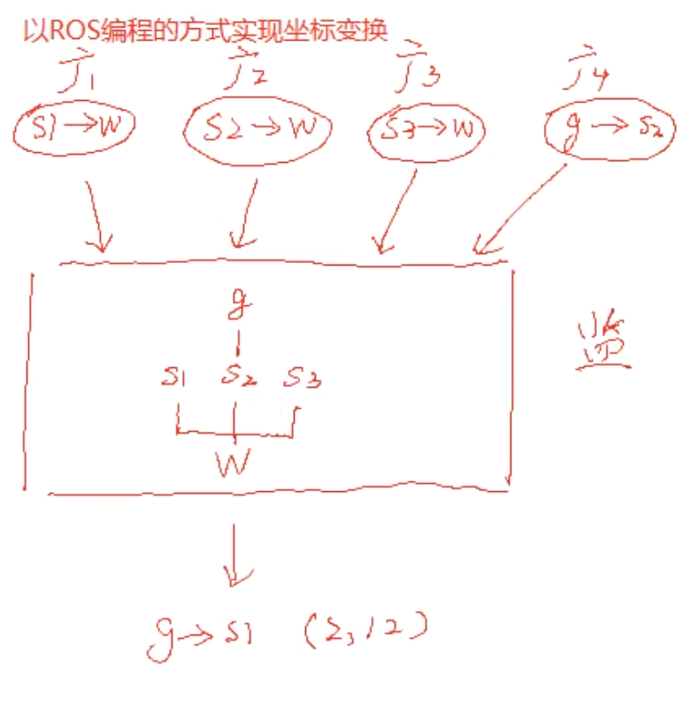

注意：坐标变换时，需要参考消息数据中的时间戳。需要保证参与变换的两个坐标帧的时间差在一定范围内，否则可能会导致误差偏大。

​           坐标变换基于右手坐标系。


安装依赖

```shell
sudo apt-get install ros-humble-turtle-tf2-py ros-humble-tf2-tools ros-humble-tf-transformations 
```

安装``TRANSFORMS3D``的Python包，为``tf_transformations``提供四元数和欧拉角变换功能

```shell
pip3 install transforms3d
```


### 3-5-2 坐标相关消息

常用的两种接口消息：``geometry_msgs/msg/TransformStamped`` 和 ``geometry_msgs/msg/PointStamped``

前者用于描述某一时刻两个坐标系之间相对关系的接口，后者用于描述某一时刻坐标系内某个坐标点的位置。

#### TransformStamped&PointStamped 

可以使用如下命令查看接口消息

```shell
ros2 interface show geometry_msgs/msg/TransformStamped
```

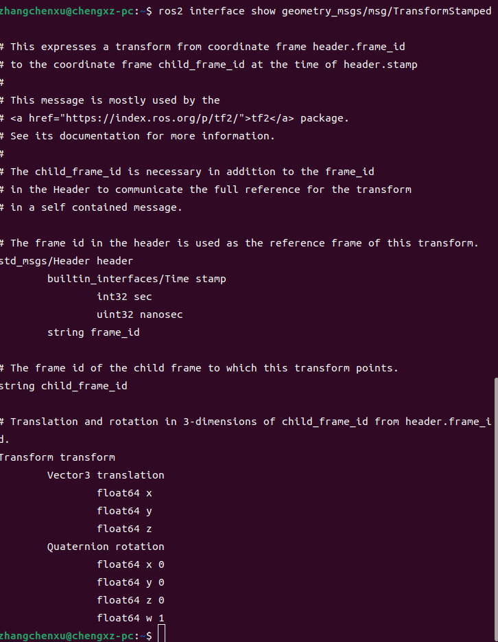

```shell
ros2 interface show geometry_msgs/msg/PointStamped
```


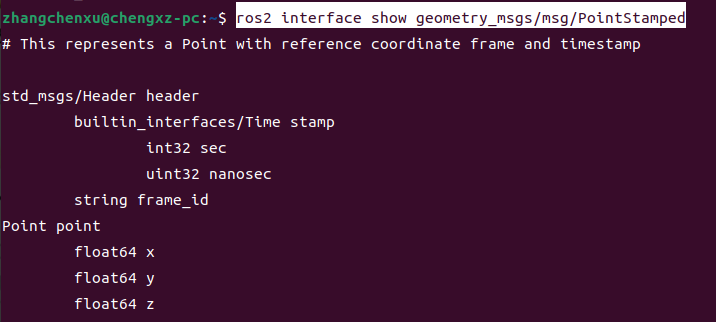


### 3-5-3 坐标变换广播

坐标系相对关系主要有两种：**静态坐标系相对关系**与**动态坐标系相对关系**

静态坐标系相对关系是指两个坐标系之间的相对位置是固定不变的

动态坐标系相对关系是指两个坐标系之间的相对位置关系是动态改变的


### 3-5-4 坐标变换广播案例

#### 静态广播器

**准备工作**

创建功能包

```shell
ros2 pkg create cpp03_tf_broadcaster --build-type ament_cmake --dependencies rclcpp tf2 tf2_ros geometry_msgs turtlesim --node-name demo01_static_tf_bro
```

关于静态广播器的官方说明

```shell
ros2 run tf2_ros static_transform_publisher
```

```shell
# 需要声明两个坐标系
required arguments:
  --frame-id FRAME_ID parent frame
  --child-frame-id CHILD_FRAME_ID child frame id
# 两个坐标系之间的关系
optional arguments:
  --x X                 x component of translation
  --y Y                 y component of translation
  --z Z                 z component of translation
  --qx QX               x component of quaternion rotation
  --qy QY               y component of quaternion rotation
  --qz QZ               z component of quaternion rotation
  --qw QW               w component of quaternion rotation
  --roll ROLL           roll component Euler rotation
  --pitch PITCH         pitch component Euler rotation
  --yaw YAW             yaw component Euler rotation
[ros2run]: Process exited with failure 1
# 时间戳不用控制
```

声明两个坐标系

```shell
ros2 run tf2_ros static_transform_publisher --frame-id base_link --child-frame-id laser
```

打开rviz2,添加插件

```shell
zhangchenxu@chengxz-pc:~$ export QT_ENABLE_HIGHDPI_SCALING=0 
zhangchenxu@chengxz-pc:~$ rviz2
```

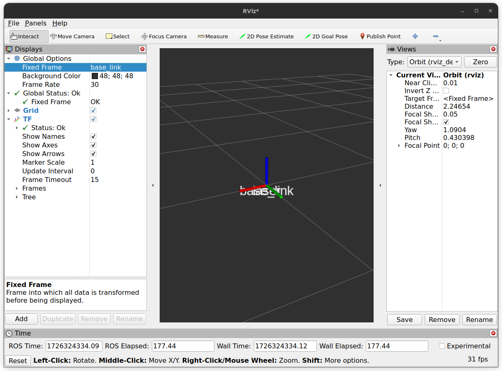

设置一个偏移量

```shell
ros2 run tf2_ros static_transform_publisher --frame-id base_link --child-frame-id laser --x 1.0
```


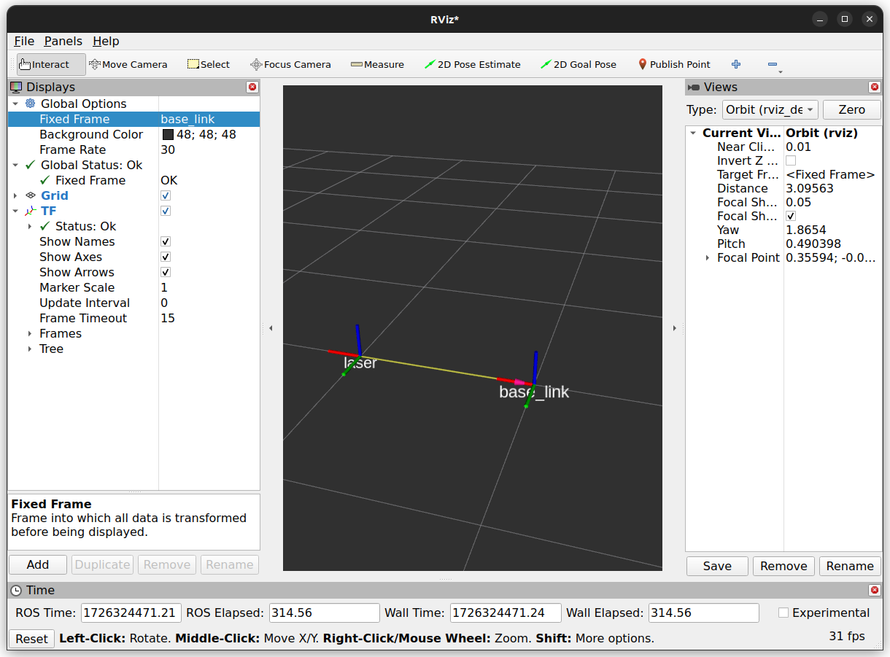

**静态广播器实现**

接下来用cpp实现以上功能

```cpp linenums="1"
// 需求：执行时传入两个坐标系的相对位子关系以及父子级坐标id，程序运行发布静态坐标变换

// ros2 run 包 可执行程序 x y z roll pitch yaw frame child_frame

//3.自定义节点类；
// 创建广播对象 组织并发布对象

//1.包含头文件
#include "rclcpp/rclcpp.hpp"

//3.自定义节点类；
class Mynode: public rclcpp::Node{
public:
    Mynode(char * argv[]):Node("mynode_node_cpp"){
        // 创建广播对象

        // 组织并发布数据

    }
};

int main(int argc, char *argv[])
{
    // 对输入的参数进行判断
    if (argc != 9)
    {
        RCLCPP_ERROR(rclcpp::get_logger("rclcpp"),("传入的参数不合法"));
        return 1;
    }
    
    
    //2.初始化ROS2客户端；
    rclcpp::init(argc,argv);
    //4.调用spain函数，并传入节点对象指针；
    rclcpp::spin(std::make_shared<Mynode>(argv));
    //5.资源释放
    rclcpp::shutdown();
    return 0;
}
```

组织并发布的数据来自于

``22 int main(int argc, char *argv[])``中的``argv[]``，``argv[]``已经封装好了，需要将其传入

`` 14 Mynode(char * argv[]):Node("mynode_node_cpp"){ ``中

同时在创建自定义节点对象指针时也需要将``argv``传入  `` 35 rclcpp::spin(std::make_shared<Mynode>(argv));``

```cpp
// 需求：执行时传入两个坐标系的相对位子关系以及父子级坐标id，程序运行发布静态坐标变换

// ros2 run 包 可执行程序 x y z roll pitch yaw frame child_frame

// 3.自定义节点类；
//  创建广播对象 组织并发布对象

// 1.包含头文件
#include "rclcpp/rclcpp.hpp"
#include "tf2_ros/static_transform_broadcaster.h"
#include "geometry_msgs/msg/transform_stamped.hpp"
#include "tf2/LinearMath/Quaternion.h"

// 3.自定义节点类；
class Mynode : public rclcpp::Node
{
public:
    Mynode(char *argv[]) : Node("mynode_node_cpp")
    {
        // 创建广播对象 #include "tf2_ros/static_transform_broadcaster.h"
        // tf2_ros::StaticTransformBroadcaster
        broadcaster_ = std::make_shared<tf2_ros::StaticTransformBroadcaster>(this);
        // 组织并发布数据
        pub_st_tf(argv);
    }

private:
    // 将对象声明成成员变量
    std::shared_ptr<tf2_ros::StaticTransformBroadcaster> broadcaster_;
    void pub_st_tf(char *argv[])
    {
        // 组织消息 #include "geometry_msgs/msg/transform_stamped.hpp"
        geometry_msgs::msg::TransformStamped transform;
        transform.header.stamp = this->now(); // 时间戳
        transform.header.frame_id = argv[7];  // 父级坐标系
        transform.child_frame_id = argv[8];   // 子级坐标系

        transform.transform.translation.x = atof(argv[1]); // x的变换 设置偏移量
        transform.transform.translation.y = atof(argv[2]); // y的变换
        transform.transform.translation.z = atof(argv[3]); // z的变换

        tf2::Quaternion qtn; // 将欧拉角转换为四元数 #include "tf2/LinearMath/Quaternion.h"
        qtn.setRPY(atof(argv[4]),atof(argv[5]),atof(argv[6]));
        transform.transform.rotation.x = qtn.x();
        transform.transform.rotation.y = qtn.y();
        transform.transform.rotation.z = qtn.z();
        transform.transform.rotation.w = qtn.w();

        // 发布
        broadcaster_->sendTransform(transform);
    }
};

int main(int argc, char *argv[])
{
    // 对输入的参数进行判断
    if (argc != 9)
    {
        RCLCPP_ERROR(rclcpp::get_logger("rclcpp"), ("传入的参数不合法"));
        return 1;
    }

    // 2.初始化ROS2客户端；
    rclcpp::init(argc, argv);
    // 4.调用spain函数，并传入节点对象指针；
    rclcpp::spin(std::make_shared<Mynode>(argv));
    // 5.资源释放
    rclcpp::shutdown();
    return 0;
}
```

编译后安装环境，并执行

```shell
ros2 run cpp03_tf_broadcaster demo01_static_tf_bro 0.4 0.0 0.2 0 0 0 base_link laser
```

打开rviz2

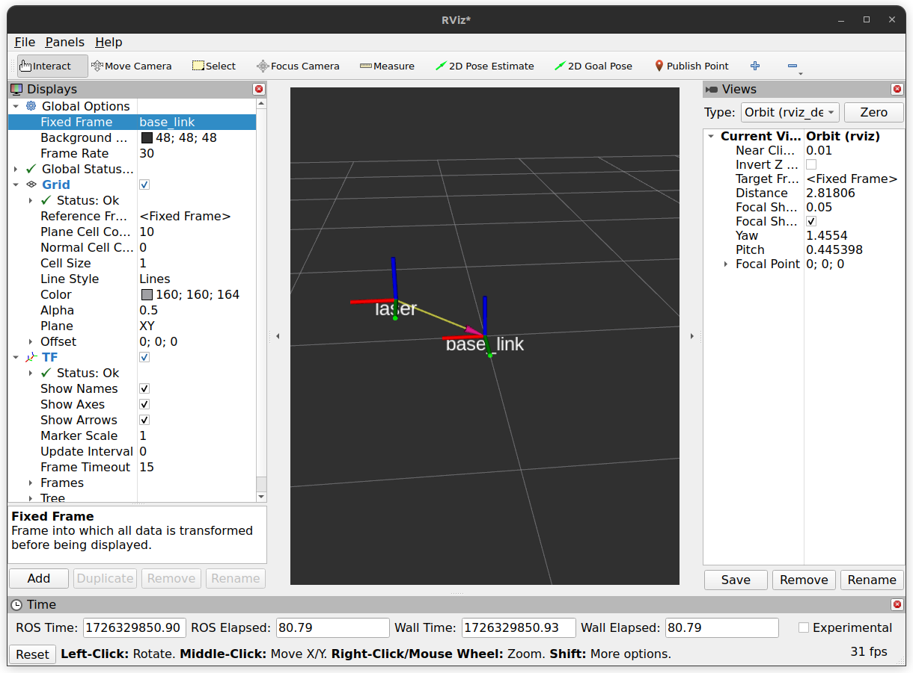

#### 动态广播器

```cpp
// 启动 turlesim_node 节点，编写程序，发布乌龟相对于窗体的位姿

// 3.自定义节点类；
//  创建动态广播器
//  创建一个乌龟位姿订阅方
//  回调函数中获取乌龟位姿,并生成相对关系并发布

// 1.包含头文件
#include "rclcpp/rclcpp.hpp"
#include "tf2_ros/transform_broadcaster.h"
#include "turtlesim/msg/pose.hpp"
#include "geometry_msgs/msg/transform_stamped.hpp"
#include "tf2/LinearMath/Quaternion.h"

// 3.自定义节点类；
class Mynode : public rclcpp::Node
{
public:
    Mynode() : Node("mynode_node_cpp")
    {
        // 创建动态广播器  #include "tf2_ros/transform_broadcaster.h"
        broadcaster_ = std::make_shared<tf2_ros::TransformBroadcaster>(this);
        // 创建乌龟订阅方
        pose_sub_ = this->create_subscription<turtlesim::msg::Pose>("/turtle1/pose", 10,
                                                                    std::bind(&Mynode::do_pose, this, std::placeholders::_1));
    }

private:
    std::shared_ptr<tf2_ros::TransformBroadcaster> broadcaster_;
    rclcpp::Subscription<turtlesim::msg::Pose>::SharedPtr pose_sub_;
    // 回调函数中，获取乌龟位姿并生成相对关系然后发布
    void do_pose(const turtlesim::msg::Pose &pose)
    {
        // 组织消息
        geometry_msgs::msg::TransformStamped ts;
        ts.header.stamp = this->now(); // 时间戳
        ts.header.frame_id = "world";  // 父级坐标系
        ts.child_frame_id = "turtle1"; // 子级坐标系

        ts.transform.translation.x = pose.x;
        ts.transform.translation.y = pose.y;
        ts.transform.translation.z = 0.0;

        tf2::Quaternion qtn; // 将欧拉角转换为四元数 #include "tf2/LinearMath/Quaternion.h"
        qtn.setRPY(0, 0, pose.theta);

        ts.transform.rotation.x = qtn.x();
        ts.transform.rotation.y = qtn.y();
        ts.transform.rotation.z = qtn.z();
        ts.transform.rotation.w = qtn.w();
        // 发布
        broadcaster_->sendTransform(ts);
    }
};

int main(int argc, char const *argv[])
{
    // 2.初始化ROS2客户端；
    rclcpp::init(argc, argv);
    // 4.调用spain函数，并传入节点对象指针；
    rclcpp::spin(std::make_shared<Mynode>());
    // 5.资源释放
    rclcpp::shutdown();
    return 0;
}
```


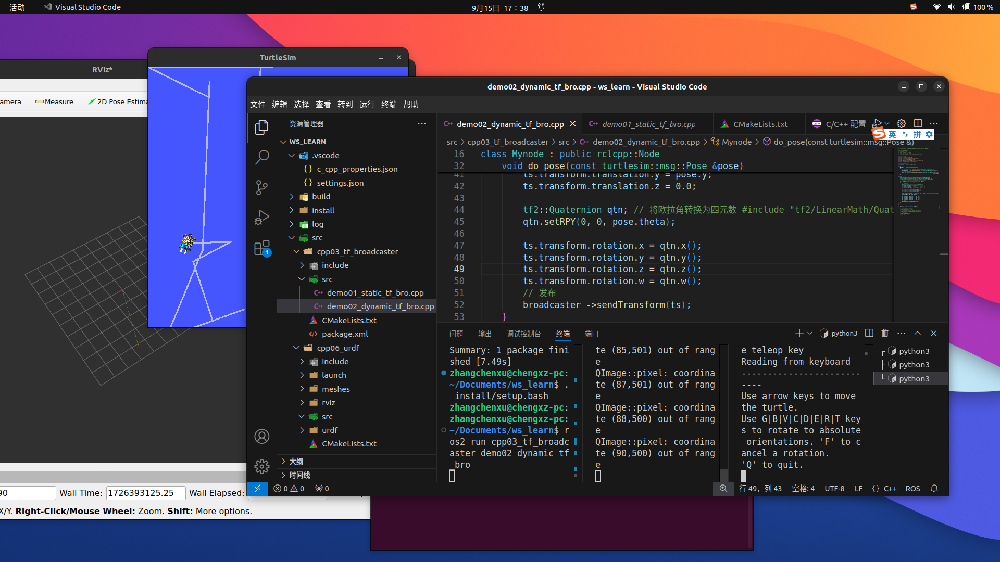


发布坐标点

```cpp
// 发布相对于laser坐标系的坐标点数据
// 创建发布方
// 创建定时器
// 组织并发布消息

// 1.包含头文件
#include "rclcpp/rclcpp.hpp"
#include "geometry_msgs/msg/point_stamped.hpp"

using namespace std::chrono_literals;

// 3.自定义节点类；
class Mynode : public rclcpp::Node
{
public:
    Mynode() : Node("mynode_node_cpp"), x(0.0)
    {
        // 创建发布方
        point_pub = this->create_publisher<geometry_msgs::msg::PointStamped>("point", 10); // 话题名称 qos
        // 创建定时器
        timer_ = this->create_wall_timer(1s, std::bind(&Mynode::on_time, this));
        // 组织并发布消息
    }

private:
    rclcpp::Publisher<geometry_msgs::msg::PointStamped>::SharedPtr point_pub;
    rclcpp::TimerBase::SharedPtr timer_;
    double_t x;

    void on_time()
    {
        // 组织消息
        geometry_msgs::msg::PointStamped ps;
        ps.header.stamp = this->now();
        ps.header.frame_id = "laser";
        x = x + 0.05;
        ps.point.x = x;
        ps.point.y = 0.0;
        ps.point.z = -0.1;
        // 发布消息
        point_pub->publish(ps);
    }
};

int main(int argc, char const *argv[])
{
    // 2.初始化ROS2客户端；
    rclcpp::init(argc, argv);
    // 4.调用spain函数，并传入节点对象指针；
    rclcpp::spin(std::make_shared<Mynode>());
    // 5.资源释放
    rclcpp::shutdown();
    return 0;
}
```

安装和启动节点

```bash
zhangchenxu@chengxz-pc:~/Documents/ws_learn$ . install/setup.bash 
zhangchenxu@chengxz-pc:~/Documents/ws_learn$ ros2 run cpp03_tf_broadcaster demo03_point_tf_bro 
^C[INFO] [1726415434.302317168] [rclcpp]: signal_handler(signum=2)
```

创建坐标系

```bash
zhangchenxu@chengxz-pc:~/Documents/ws_learn$ ros2 run tf2_ros static_transform_publisher --frame-id base_link --child-frame-id laser --x 0.2 --z 0.1
```

开启rviz2

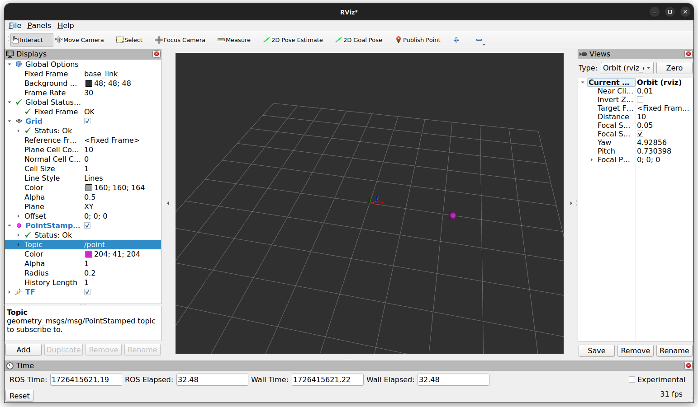


### 3-5-5 坐标变换监听

#### 坐标系变换

```cpp
// 先发布laser到base_link，再发布camera到base_link的坐标关系，求解laser到camera的坐标相对关系

// 3-1.创建缓存对象，融合多个坐标系相对关系为一颗坐标树
// 3-2.创建监听器，绑定缓存对象，会将所有广播器广播的数据写入缓存
// 3-3.编写定时器，循环实现转换
// 1.包含头文件
#include "rclcpp/rclcpp.hpp"
#include "tf2_ros/buffer.h"
#include "tf2_ros/transform_listener.h"

using namespace std::chrono_literals;

// 3.自定义节点类；
class Mynode : public rclcpp::Node
{
public:
    Mynode() : Node("mynode_node_cpp")
    {
        // 3-1.创建缓存对象，融合多个坐标系相对关系为一颗坐标树 #include "tf2_ros/buffer.h"
        buffer_ = std::make_unique<tf2_ros::Buffer>(this->get_clock());
        // 3-2.创建监听器，绑定缓存对象，会将所有广播器广播的数据写入缓存
        listener_ = std::make_shared<tf2_ros::TransformListener>(*buffer_, this);
        // 3-3.编写定时器，循环实现转换
        timer_ = this->create_wall_timer(1s, std::bind(&Mynode::on_timer, this));
    }

private:
    std::unique_ptr<tf2_ros::Buffer> buffer_;
    std::shared_ptr<tf2_ros::TransformListener> listener_;
    rclcpp::TimerBase::SharedPtr timer_;
    void on_timer()
    // 实现坐标系转换

    {
        try
        {
            auto ts = buffer_->lookupTransform("camera", "laser", tf2::TimePointZero); // tf2::TimePointZero转换最新时刻的时间帧
            RCLCPP_INFO(this->get_logger(), "---完成转换的坐标信息---");
            RCLCPP_INFO(this->get_logger(),
                        "新坐标系：父：%s,子：%s,偏移量（%.2f,%.2f,%.2f)",
                        ts.header.frame_id.c_str(), // camera
                        ts.child_frame_id.c_str(),  // laser
                        ts.transform.translation.x,
                        ts.transform.translation.y,
                        ts.transform.translation.z);
        }
        catch (const tf2::LookupException &e)
        {
            RCLCPP_INFO(this->get_logger(), "异常提示：%s", e.what());
        }
    }
};

int main(int argc, char const *argv[])
{
    // 2.初始化ROS2客户端；
    rclcpp::init(argc, argv);
    // 4.调用spain函数，并传入节点对象指针；
    rclcpp::spin(std::make_shared<Mynode>());
    // 5.资源释放
    rclcpp::shutdown();
    return 0;
}
```

建立父级坐标系 base_link和子坐标系laser关系

```bash
ros2 run tf2_ros static_transform_publisher --frame-id base_link --child-frame-id laser --x 0.4 --z 0.2
```

建立父级坐标系 base_link和子坐标系camera关系

```bash
ros2 run tf2_ros static_transform_publisher --frame-id base_link --child-frame-id camera --x -0.5 --z 0.4
```

开启转换

```bash
ros2 run cpp04_tf_listener demo01_tf_listener
```

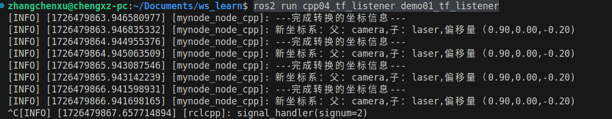


#### 坐标点变换

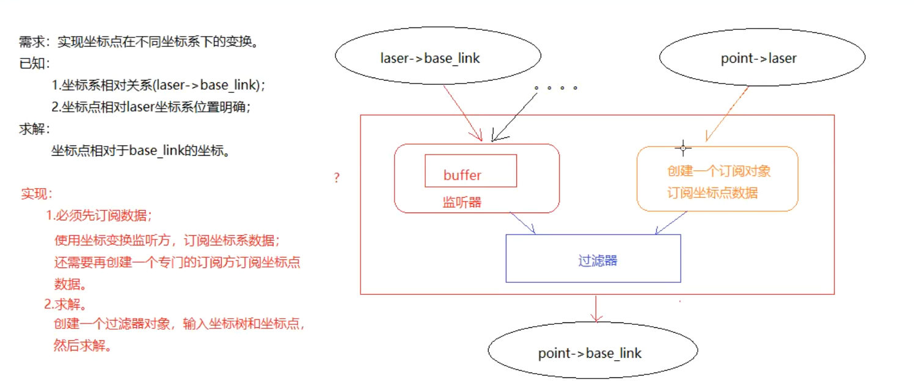

```cpp
// 需求：laser到base_link的坐标系相对关系，然后发布point到laser的坐标，求解point到base_link的坐标
// 3-1.创建坐标变换监听器
// 3-2.创建坐标点消息订阅方
// 3-3.创建过滤器，解析数据
// 1.包含头文件
#include "rclcpp/rclcpp.hpp"
#include "tf2_ros/buffer.h"
#include "tf2_ros/transform_listener.h"
#include "tf2_ros/create_timer_ros.h"
#include "message_filters/subscriber.h"
#include "geometry_msgs/msg/point_stamped.hpp"
#include "tf2_ros/message_filter.h"
#include "tf2_geometry_msgs/tf2_geometry_msgs.hpp"

using namespace std::chrono_literals;

// 3.自定义节点类；
class Mynode : public rclcpp::Node
{
public:
    Mynode() : Node("mynode_node_cpp")
    {
        // 3-1.创建坐标变换监听器
        buffer_ = std::make_shared<tf2_ros::Buffer>(this->get_clock());
        timer_ = std::make_shared<tf2_ros::CreateTimerROS>(
            this->get_node_base_interface(),
            this->get_node_timers_interface());
        buffer_->setCreateTimerInterface(timer_);
        listener_ = std::make_shared<tf2_ros::TransformListener>(*buffer_);
        // 3-2.创建坐标点消息订阅方
        point_sub.subscribe(this, "point");
        // 3-3.创建过滤器，解析数据
        filter_ = std::make_shared<tf2_ros::MessageFilter<geometry_msgs::msg::PointStamped>>(
            point_sub,
            *buffer_,
            "base_link",
            10,
            this->get_node_logging_interface(),
            this->get_node_clock_interface(),
            2s);
        // 解析数据
        filter_->registerCallback(&Mynode::transform_point, this);
    }

private:
    // 创建缓存器
    std::shared_ptr<tf2_ros::Buffer> buffer_;
    // 创建监听器
    std::shared_ptr<tf2_ros::TransformListener> listener_;
    //
    std::shared_ptr<tf2_ros::CreateTimerROS> timer_;
    //
    message_filters::Subscriber<geometry_msgs::msg::PointStamped> point_sub;
    // 过滤器 geometry_msgs::msg::PointStamped 过滤的是坐标点
    std::shared_ptr<tf2_ros::MessageFilter<geometry_msgs::msg::PointStamped>> filter_;
    void transform_point(const geometry_msgs::msg::PointStamped &ps)
    {
        // 实现坐标点变换 被转化的点 基坐标系
        // 包含#include "tf2_geometry_msgs/tf2_geometry_msgs.hpp"
        auto out = buffer_->transform(ps, "base_link");
        RCLCPP_INFO(this->get_logger(),"父：%s,坐标：%.2f,%.2f,%.2f",
            out.header.frame_id.c_str(),
            out.point.x,
            out.point.y,
            out.point.z
        );
    }
};

int main(int argc, char const *argv[])
{
    // 2.初始化ROS2客户端；
    rclcpp::init(argc, argv);
    // 4.调用spain函数，并传入节点对象指针；
    rclcpp::spin(std::make_shared<Mynode>());
    // 5.资源释放
    rclcpp::shutdown();
    return 0;
}
```

首先发布base_link以及laser的静态坐标

```bash
zhangchenxu@chengxz-pc:~$ ros2 run tf2_ros static_transform_publisher --frame-id base_link --child-frame-id laser --x 0.4 --z 0.2
```

由之前的项目发布一个随时间相对laser移动的点

```bash
zhangchenxu@chengxz-pc:~/Documents/ws_learn$ . install/setup.bash 
zhangchenxu@chengxz-pc:~/Documents/ws_learn$ ros2 run cpp03_tf_broadcaster demo03_point_tf_bro
```

运行坐标点变换的项目

```bash
zhangchenxu@chengxz-pc:~/Documents/ws_learn$ . install/setup.bash 
zhangchenxu@chengxz-pc:~/Documents/ws_learn$ ros2 run cpp04_tf_listener demo02_msg_filter 
```

可得到如下结果

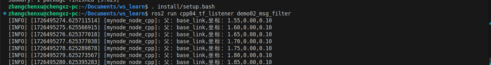
