# 三、案例复现(猛狮集训营)

> 涵盖 RViz、URDF、Xacro、关节状态发布及机器人模型仿真的基础实践。

[← 返回总目录](../../README.md) · [↑ 返回本章目录](README.md) · [← 上一节：3-5 坐标变换](05-coordinate-transforms.md) · [下一节：3-7 Launch →](07-launch.md)

---

## 3-6 可视化

### 3-6-1 RVIZ启动

一般在安装桌面版ROS2时，RVIZ2一般已经安装

**启动方式：**终端输入``rviz``或``ros2 run rviz2 rviz2``

**可能遇到的问题：**启动时主界面闪烁

在终端启动rviz前首先设置系统变量 QT_ENABLE_HIGHDPI_SCALING=0 ，或者设置QT_SCREEN_SCALE_FACTORS=1

```shell
export QT_ENABLE_HIGHDPI_SCALING=0 
```


### 3-6-2 插件列表


### 3-6-3 rviz2集成URDF

创建功能包

```shell
ros2 pkg create cpp06_urdf --build-type ament_cmake
```

功能包下新建 urdf、rviz、launch、meshes 目录以备用，其中 urdf 目录下再新建子目录 urdf 与
xacro，分别用于存储 urdf 文件和 xacro 文件

#### |--案例实现

**1、编辑配置文件**

在package.xml文件中需要添加一些**执行时**的依赖：

```xml
<exec_depend>rviz2</exec_depend>
<exec_depend>xacro</exec_depend>
<exec_depend>robot_state_publisher</exec_depend><exec_depend>joint_state_publisher</exec_depend>
<exec_depend>ros2launch</exec_depend>
```

在CMakeLists.txt中需要为创建的urdf、rviz、launch、meshes 目录配置安装路径

```cmake
install(DIRECTORY launch rviz urdf meshes  # 安装launch rviz urdf meshes四个新建文件夹
  DESTINATION share/${PROJECT_NAME}         # 指定目录为 install中share下的与项目同名的
)
```

**2、URDF文件实现**

```xml
<!-- 创建长方体 -->

<robot name="demo01">
    <link name="base_link">
        <!-- 可视化 -->
        <visual>
            <!-- 几何形状 -->
            <geometry>
                <!-- box 长方体形状 -->
                <box size="1.0 0.5 0.1"/>
            </geometry>
        </visual>      
    </link>   
</robot>

```

单纯的urdf文件是无法启动的，需要使用launch文件

**3、launch文件**

在launch文件夹下新建``display.launch.py``文件

```py
from launch import LaunchDescription
from launch_ros.actions import Node
# ---|封装终端指令相关类
# from launch.actions import ExecuteProcess
# from launch.substitutions import FindExecutable
# ---|参数声明与获取
# from launch.actions import DeclareLaunchArgument
# from launch.substitutions import LaunchConfiguration
# ---|文件包含相关
# from launch.action import IncludeLaunchDescription
# from launch.launch_description_sources import PythonLaunchDescriptionSource
# ---|分组相关
# from launch_ros.actions import PushRosNamespace
# from launch.actions import GroupAction
# ---|事件相关
# from launch.event_handlers import OnProcessStart, OnProcessExit
# from launch.actions import ExecuteProcess, RegisterEventHandler,LogInfo
# ---|获取功能包下 share 目录路径
# from ament_index_python.packages import get_package_share_directory

from launch_ros.parameter_descriptions import ParameterValue
# 封装指令执行的库
from launch.substitutions import Command
# ---|获取功能包下 share 目录路径
from ament_index_python.packages import get_package_share_directory

from launch import LaunchDescription
from launch.actions import ExecuteProcess
from launch.substitutions import EnvironmentVariable

def generate_launch_description():
    """
        需求：加载URDF中的文件至RVIZ2中
        核心：
            1、启动robot_state_publisher节点，该节点要以参数的方式加载URDF文件内容
            2、启动RVIZ2节点
    """  
    # 1、启动robot_state_publisher节点，该节点要以参数的方式加载URDF文件内容
    p_value = ParameterValue(Command(["xacro ",get_package_share_directory("cpp06_urdf") + "/urdf/urdf/demo01.urdf"]))
    robot_state_pub = Node(
        package="robot_state_publisher",
        executable="robot_state_publisher",
        parameters=[{"robot_description":p_value}]
    )
    # 2、启动RVIZ2节点
    rviz2 = Node(package="rviz2",executable="rviz2") 
    return LaunchDescription([robot_state_pub,
                              rviz2])
```

其中``parameters=[{"robot_description":p_value}]``处，``parameters``实际就是urdf中的参数，但如果直接在此处则移植性变差

此处通过``from launch.substitutions import Command``使launch文件能够执行指令

使用``from ament_index_python.packages import get_package_share_directory``使可以直接访问share下的目录

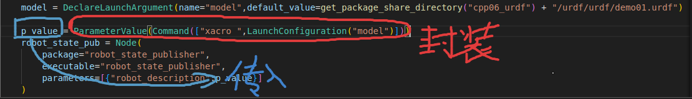

之后编译并启动

```shell
colcon build
. install/setup.bash
export QT_ENABLE_HIGHDPI_SCALING=0 
ros2 launch cpp06_urdf display.launch.py 
```

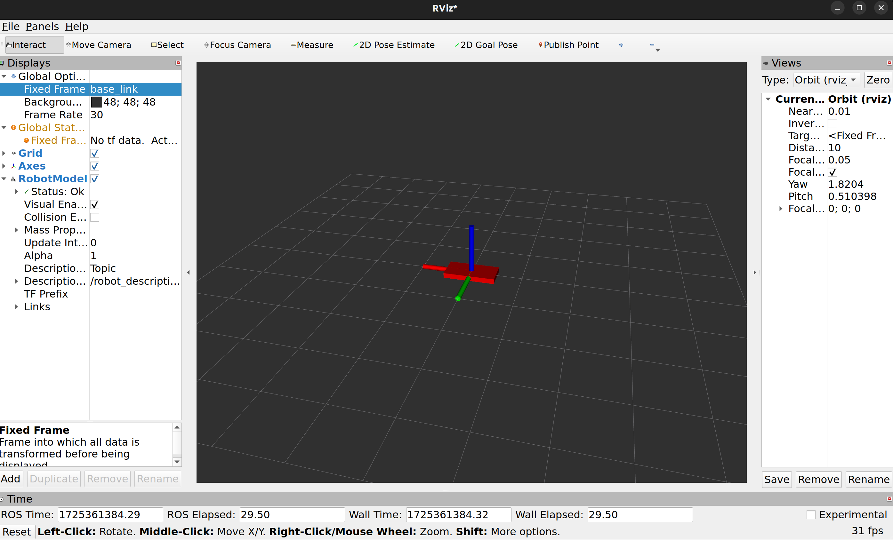

增加插件后进行相应配置，可以展现相应的模型

#### |--优化（发布活动关节）

```py
from launch import LaunchDescription
from launch_ros.actions import Node
# ---|封装终端指令相关类
# from launch.actions import ExecuteProcess
# from launch.substitutions import FindExecutable
# ---|参数声明与获取
from launch.actions import DeclareLaunchArgument
from launch.substitutions import LaunchConfiguration
# ---|文件包含相关
# from launch.action import IncludeLaunchDescription
# from launch.launch_description_sources import PythonLaunchDescriptionSource
# ---|分组相关
# from launch_ros.actions import PushRosNamespace
# from launch.actions import GroupAction
# ---|事件相关
# from launch.event_handlers import OnProcessStart, OnProcessExit
# from launch.actions import ExecuteProcess, RegisterEventHandler,LogInfo
# ---|获取功能包下 share 目录路径
# from ament_index_python.packages import get_package_share_directory

# ParameterValue，可视化操作需要
from launch_ros.parameter_descriptions import ParameterValue
# 封装指令执行的库
from launch.substitutions import Command
# ---|获取功能包下 share 目录路径
from ament_index_python.packages import get_package_share_directory

from launch import LaunchDescription
from launch.actions import ExecuteProcess
from launch.substitutions import EnvironmentVariable

def generate_launch_description():
    """
        需求：加载URDF中的文件至RVIZ2中
        核心：
            1、启动robot_state_publisher节点，该节点要以参数的方式加载URDF文件内容；
            2、启动RVIZ2节点；
        优化：
            1、添加 joint_state_publisher 节点，机器人涉及非固定关节，必须包含该节点；
            2、设置RVIZ2的默认配置文件；

    """  
    # 1、启动robot_state_publisher节点，该节点要以参数的方式加载URDF文件内容
    # p_value = ParameterValue(Command(["xacro ",get_package_share_directory("cpp06_urdf") + "/urdf/urdf/demo01.urdf"]))
    # 优化实现
    # 可以实现当添加了新的urdf文件后，在终端运行时可以修改需要加载的模型   
    # get_package_share_directory：可以定位到share目录
    model = DeclareLaunchArgument(name="model",default_value=get_package_share_directory("cpp06_urdf") + "/urdf/urdf/demo01.urdf") 
    p_value = ParameterValue(Command(["xacro ",LaunchConfiguration("model")]))
    
    # 1、启动robot_state_publisher节点，该节点要以参数的方式加载URDF文件内容
    robot_state_pub = Node(
        package="robot_state_publisher",
        executable="robot_state_publisher",
        parameters=[{"robot_description":p_value}]
    )
    # 优化1
    # 复杂机器人，非固定关节需要这个节点
    joint_state_pub = Node(
        package="joint_state_publisher",
        executable="joint_state_publisher"
    )
    # 2、启动RVIZ2节点
    rviz2 = Node(
        package="rviz2",
        executable="rviz2",
        # 配置文件目录
        arguments=["-d",get_package_share_directory("cpp06_urdf") + "/rviz/urdf.rviz"]

    )
    return LaunchDescription([model,
                              robot_state_pub,
                              joint_state_pub,
                              rviz2]
                            )
```


#### |--URDF使用语法

##### |--**robot**

urdf 中为了保证 xml 语法的完整性，使用了 robot 标签作为根标签


##### |--**link**

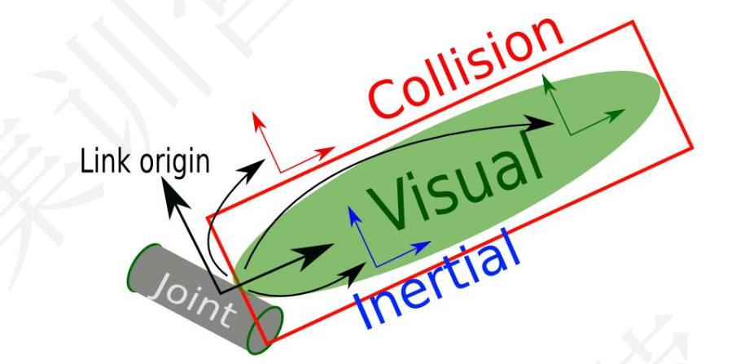

属性：

name（必填）：为连杆命名。

子标签:

<visual>（可选）：用于描述 link 的可视化属性，可以设置 link 的形状（立方体、球体、圆柱等）。

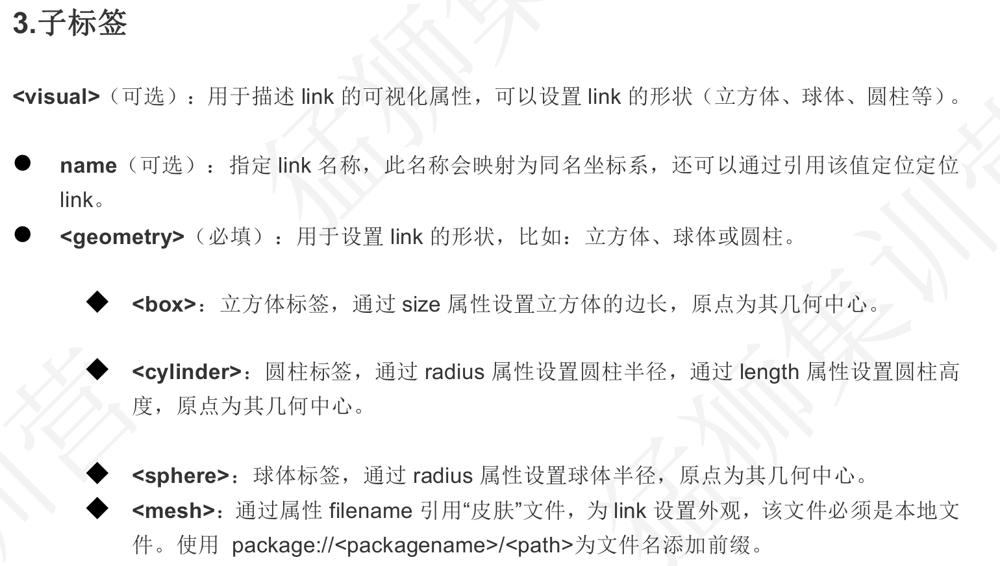

<collision> ：连杆的碰撞属性.

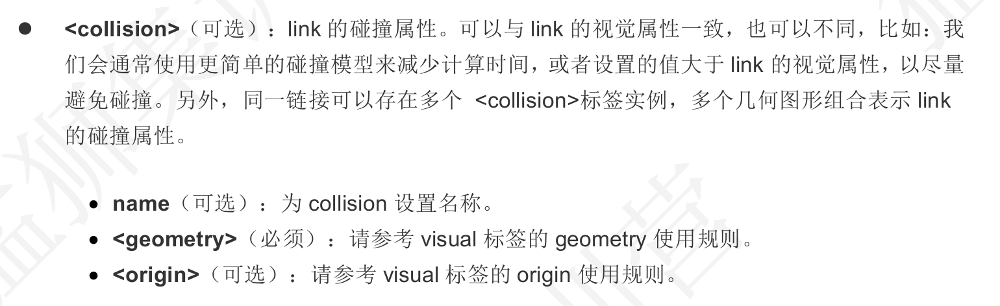

<Inertial >:连杆的惯性矩阵

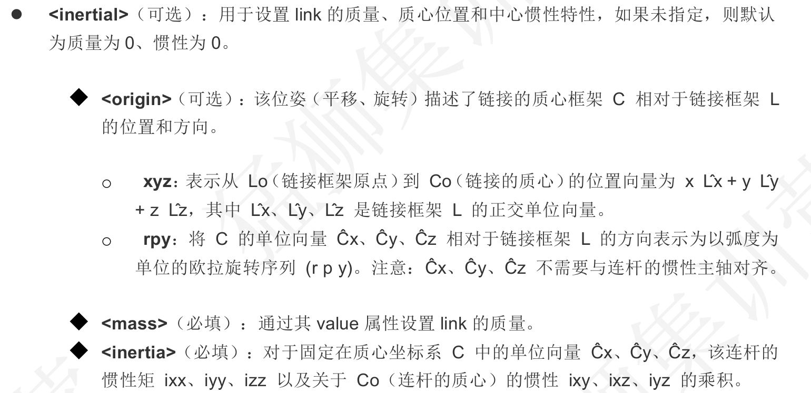

语法示例：

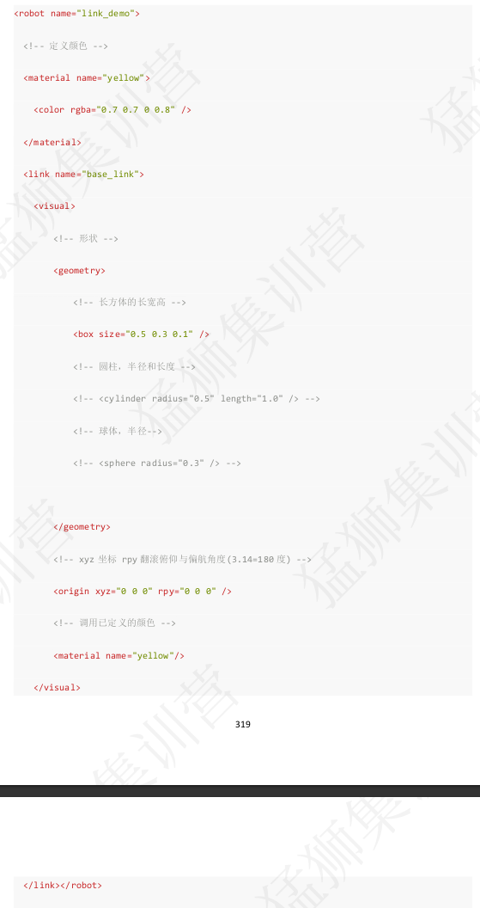

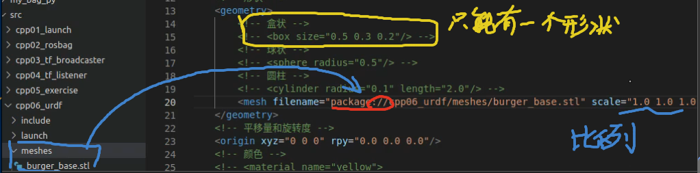


##### |--**joint**

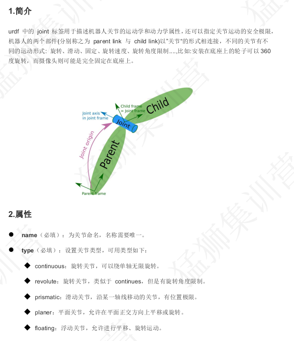


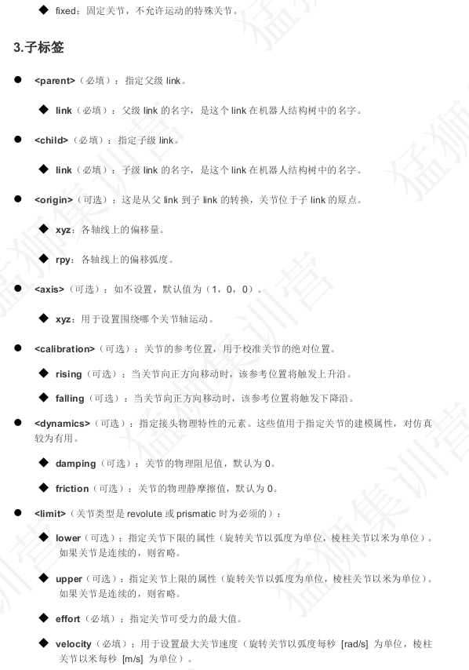

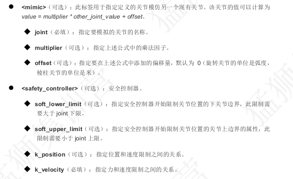


示例：

URDF:

```xml
<!-- 创建一个机器人模型，由底盘和摄像头组成，摄像头可沿着z轴旋转
     1、创建底盘相关的Link
     2、创建摄像头Link
     3、通过joint关联底盘与摄像头
-->
<robot name="demo_joint">
    <!-- 抽取整体颜色 -->
     <material name="yellow">
        <color rgba="0.8 0.8 0.0 0.5"/>       
     </material>
     <material name="red">
        <color rgba="0.9 0.0 0.0 0.5"/>       
     </material>
    <!-- 1、创建底盘相关link -->
     <link name="base_link">
        <visual>
            <geometry>
                <box size="0.5 0.3 0.1"/>
            </geometry>
            <material name="yellow"/>
        </visual>     
     </link>
     <!-- 2、创建摄像头link -->
      <link name="camera">
        <visual>
            <geometry>
            <box size="0.02 0.05 0.05"/>
            </geometry>
            <material name="red"/>
        </visual>
      </link>

      <!-- 3、关联底盘和摄像头 -->
       <joint name="camera2base_link" type="continuous">
            <parent link="base_link"/>
            <child link="camera"/>
            <!-- 设置平移量和旋转度 -->
            <origin xyz="0.2 0.0 0.075"/>
            <!-- 沿哪个坐标轴旋转 -->
            <axis xyz="0 0 1"/>
       </joint>
    
</robot>
```

Launch:

```python
from launch import LaunchDescription
from launch_ros.actions import Node
# ---|封装终端指令相关类
# from launch.actions import ExecuteProcess
# from launch.substitutions import FindExecutable
# ---|参数声明与获取
from launch.actions import DeclareLaunchArgument
from launch.substitutions import LaunchConfiguration
# ---|文件包含相关
# from launch.action import IncludeLaunchDescription
# from launch.launch_description_sources import PythonLaunchDescriptionSource
# ---|分组相关
# from launch_ros.actions import PushRosNamespace
# from launch.actions import GroupAction
# ---|事件相关
# from launch.event_handlers import OnProcessStart, OnProcessExit
# from launch.actions import ExecuteProcess, RegisterEventHandler,LogInfo
# ---|获取功能包下 share 目录路径
# from ament_index_python.packages import get_package_share_directory

# ParameterValue，可视化操作需要
from launch_ros.parameter_descriptions import ParameterValue
# 封装指令执行的库
from launch.substitutions import Command
# ---|获取功能包下 share 目录路径
from ament_index_python.packages import get_package_share_directory

from launch import LaunchDescription
from launch.actions import ExecuteProcess
from launch.substitutions import EnvironmentVariable

def generate_launch_description():
    """
        需求：加载URDF中的文件至RVIZ2中
        核心：
            1、启动robot_state_publisher节点，该节点要以参数的方式加载URDF文件内容；
            2、启动RVIZ2节点；
        优化：
            1、添加 joint_state_publisher 节点，机器人涉及非固定关节，必须包含该节点；
            2、设置RVIZ2的默认配置文件；

    """  
    # 1、启动robot_state_publisher节点，该节点要以参数的方式加载URDF文件内容
    # p_value = ParameterValue(Command(["xacro ",get_package_share_directory("cpp06_urdf") + "/urdf/urdf/demo01.urdf"]))
    # 优化实现
    # 可以实现当添加了新的urdf文件后，在终端运行时可以修改需要加载的模型   
    # get_package_share_directory：可以定位到share目录
    model = DeclareLaunchArgument(name="model",default_value="install/cpp06_urdf/share/cpp06_urdf/urdf/urdf/demo_joint.urdf") 
    p_value = ParameterValue(Command(["xacro ",LaunchConfiguration("model")]))
    
    # 1、启动robot_state_publisher节点，该节点要以参数的方式加载URDF文件内容
    robot_state_pub = Node(
        package="robot_state_publisher",
        executable="robot_state_publisher",
        parameters=[{"robot_description":p_value}]
    )
    # 优化1
    # 复杂机器人，非固定关节需要这个节点
    joint_state_pub = Node(
        package="joint_state_publisher",
        executable="joint_state_publisher"
    )
    # 2、启动RVIZ2节点
    rviz2 = Node(
        package="rviz2",
        executable="rviz2",
        # 配置文件目录
        # arguments=["-d","src/cpp06_urdf/urdf/urdf/demo_joint.urdf"]

    )
    return LaunchDescription([model,
                              robot_state_pub,
                              joint_state_pub,
                              rviz2]
                            )
```

编译之后通过launch文件启动

使用

```bash
ros2 run joint_state_publisher_gui joint_state_publisher_gui
```

开启一个UI窗口

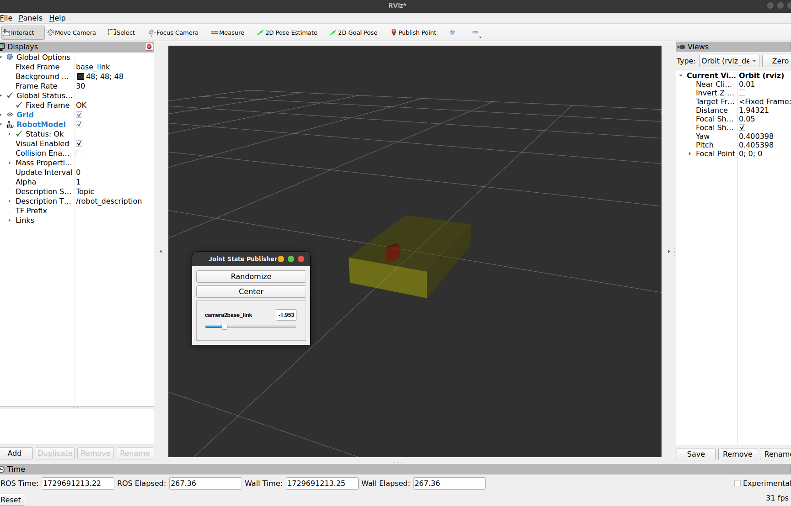

拖动进度条可以实现关节旋转

##### |--joint_state_publisher的作用

1、``joint_state_publisher``与``joint_state_publisher_gui``作用一致，都会发布非固定关节的运动信息；

2、``robot_state_publisher``会订阅关节的运动信息，并生成坐标变换数据广播；

3、``joint_state_publisher``与``joint_state_publisher_gui``有一个存在时，就会发布关节运动信息，进而生成坐标变换，

​	当两个都不启动时，坐标树生成不了，机器人模型显示异常。

​	当两个都启动时，``joint_state_publisher``会一直发布初始关节信息``joint_state_publisher_gui``发布指定关节位姿信息，最终  	显示会产生抖动


##### |--示例：四轮差速小车

**URDF**文件：

```xml
<!-- 创建一个机器人模型，由底盘和摄像头组成，摄像头可沿着z轴旋转
     1、创建底盘相关的Link
     2、创建摄像头Link
     3、通过joint关联底盘与摄像头
-->
<robot name="demo_joint">
    <!-- 抽取整体颜色 -->
     <material name="yellow">
        <color rgba="0.8 0.8 0.0 0.5"/>       
     </material>
     <material name="red">
        <color rgba="0.9 0.0 0.0 0.5"/>       
     </material>
    <!-- 设置初始化Link -->
     <link name="base_footprint">
        <visual>
            <geometry>
                <geometry>
                    <sphere radius="0.001"/>
                </geometry>
            </geometry>
        </visual>
     </link>

    <!-- 1、创建底盘相关link -->
     <link name="base_link">
        <visual>
            <geometry>
                <box size="0.5 0.3 0.1"/>
            </geometry>
            <material name="yellow"/>
        </visual>     
     </link>

     <!-- 初始化Link通过关节连接base_link,设置关节偏移量，让base_link上移 -->
     <joint name="base_footprint2base_link" type="fixed">
        <parent link="base_footprint"/>
        <child link="base_link"/>
        <origin xyz="0.0 0.0 0.05"/>
     </joint>

     <!-- 2、创建摄像头link -->
      <link name="camera">
        <visual>
            <geometry>
            <box size="0.02 0.05 0.05"/>
            </geometry>
            <material name="red"/>
        </visual>
      </link>

      <!-- 3、关联底盘和摄像头 -->
       <joint name="camera2base_link" type="continuous">
            <parent link="base_link"/>
            <child link="camera"/>
            <!-- 设置平移量和旋转度 -->
            <origin xyz="0.2 0.0 0.075"/>
            <!-- 关节沿哪个坐标轴旋转 -->
            <axis xyz="0 0 1"/>
       </joint>
    
</robot>
```


**Launch**文件

```python
from launch import LaunchDescription
from launch_ros.actions import Node
# ---|封装终端指令相关类
# from launch.actions import ExecuteProcess
# from launch.substitutions import FindExecutable
# ---|参数声明与获取
from launch.actions import DeclareLaunchArgument
from launch.substitutions import LaunchConfiguration
# ---|文件包含相关
# from launch.action import IncludeLaunchDescription
# from launch.launch_description_sources import PythonLaunchDescriptionSource
# ---|分组相关
# from launch_ros.actions import PushRosNamespace
# from launch.actions import GroupAction
# ---|事件相关
# from launch.event_handlers import OnProcessStart, OnProcessExit
# from launch.actions import ExecuteProcess, RegisterEventHandler,LogInfo
# ---|获取功能包下 share 目录路径
# from ament_index_python.packages import get_package_share_directory

# ParameterValue，可视化操作需要
from launch_ros.parameter_descriptions import ParameterValue
# 封装指令执行的库
from launch.substitutions import Command
# ---|获取功能包下 share 目录路径
from ament_index_python.packages import get_package_share_directory

from launch import LaunchDescription
from launch.actions import ExecuteProcess
from launch.substitutions import EnvironmentVariable

def generate_launch_description():
    """
        需求：加载URDF中的文件至RVIZ2中
        核心：
            1、启动robot_state_publisher节点，该节点要以参数的方式加载URDF文件内容；
            2、启动RVIZ2节点；
        优化：
            1、添加 joint_state_publisher 节点，机器人涉及非固定关节，必须包含该节点；
            2、设置RVIZ2的默认配置文件；

    """  
    # 1、启动robot_state_publisher节点，该节点要以参数的方式加载URDF文件内容
    # p_value = ParameterValue(Command(["xacro ",get_package_share_directory("cpp06_urdf") + "/urdf/urdf/demo01.urdf"]))
    # 优化实现
    # 可以实现当添加了新的urdf文件后，在终端运行时可以修改需要加载的模型   
    # get_package_share_directory：可以定位到share目录
    model = DeclareLaunchArgument(name="model",default_value="install/cpp06_urdf/share/cpp06_urdf/urdf/urdf/exercise.urdf") 
    p_value = ParameterValue(Command(["xacro ",LaunchConfiguration("model")]))
    
    # 1、启动robot_state_publisher节点，该节点要以参数的方式加载URDF文件内容
    robot_state_pub = Node(
        package="robot_state_publisher",
        executable="robot_state_publisher",
        parameters=[{"robot_description":p_value}]
    )
    # 优化1
    # 复杂机器人，非固定关节需要这个节点
    joint_state_pub = Node(
        package="joint_state_publisher",
        executable="joint_state_publisher"
    )
    # 2、启动RVIZ2节点
    rviz2 = Node(
        package="rviz2",
        executable="rviz2",
        # 配置文件目录
        # arguments=["-d","src/cpp06_urdf/urdf/urdf/demo_joint.urdf"]

    )
    return LaunchDescription([model,
                              robot_state_pub,
                              joint_state_pub,
                              rviz2]
                            )
```


**效果图**

启用

```bash
ros2 run joint_state_publisher_gui joint_state_publisher_gui 
```


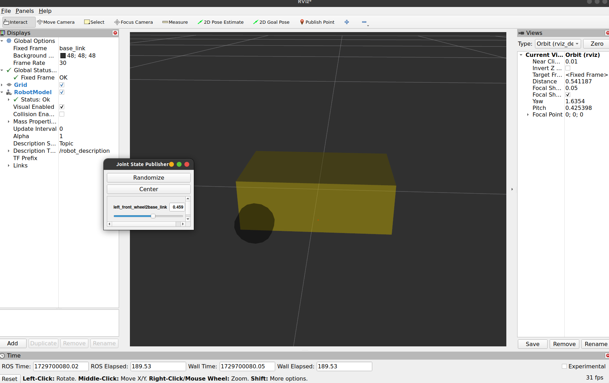

**完整建模**

```xml
<!-- 
    需求：创建一个四轮差速机器人
    参数：长0.2m 宽0.12m 高0.07m 轮胎半径及宽度为0.025 0.02，离地间距0.15m
    步骤
    1、设置base_footprint;
    2、设置base_link;
    3、使用joint将二者关联；
    4、添加一个车轮link;
    5、将车轮与base_link关联；
    6、其他车轮实现
-->
<robot name="my_car">
    <!-- 0、抽取颜色 -->
    <material name="yellow">
        <color rgba="0.8 0.7 0.0 0.5" />
    </material>
    <material name="black">
        <color rgba="0.0 0.0 0.0 0.5" />
    </material>

    <!-- 1、设置base_footprint -->
    <link name="base_footprint">
        <visual>
            <geometry>
                <sphere radius="0.001" />
            </geometry>
        </visual>
    </link>
    <!-- 2、设置base_link -->
    <link name="base_link">
        <visual>
            <geometry>
                <box size="0.2 0.12 0.07" />
            </geometry>
            <!-- 颜色 -->
            <material name="yellow" />
        </visual>
    </link>
    <!-- 3、使用joint将二者关联 -->
    <joint name="base_footprint2base_link" type="fixed">
        <parent link="base_footprint" />
        <child link="base_link" />
        <!-- z偏移 = 车体高度/2 + 离地间距 -->
        <origin xyz="0.0 0.0 0.05" />
    </joint>
    <!-- 4、添加一个车轮link -->
    <link name="left_front_wheel">
        <visual>
            <geometry>
                <cylinder radius="0.025" length="0.02" />
            </geometry>
            <!-- 颜色 -->
            <material name="black" />
            <!-- 将车轮竖立起来 -->
            <origin rpy="1.57 0.0 0.0" />
        </visual>
    </link>
    <!-- 5、将车轮与base_link关联； -->
    <joint name="left_front_wheel2base_link" type="continuous">
        <parent link="base_link" />
        <child link="left_front_wheel" />
        <!-- 将车轮移到左前方 -->
        <origin xyz="0.08 0.06 -0.025" />
        <!-- 车轮旋转 -->
        <axis xyz="0 1 0" />
    </joint>

    <!-- 4、添加一个车轮link -->
    <link name="right_front_wheel">
        <visual>
            <geometry>
                <cylinder radius="0.025" length="0.02" />
            </geometry>
            <!-- 颜色 -->
            <material name="black" />
            <!-- 将车轮竖立起来 -->
            <origin rpy="1.57 0.0 0.0" />
        </visual>
    </link>
    <!-- 5、将车轮与base_link关联； -->
    <joint name="right_front_wheel2base_link" type="continuous">
        <parent link="base_link" />
        <child link="right_front_wheel" />
        <!-- 将车轮移 -->
        <origin xyz="0.08 -0.06 -0.025" />
        <!-- 车轮旋转 -->
        <axis xyz="0 1 0" />
    </joint>

    <!-- 4、添加一个车轮link -->
    <link name="left_back_wheel">
        <visual>
            <geometry>
                <cylinder radius="0.025" length="0.02" />
            </geometry>
            <!-- 颜色 -->
            <material name="black" />
            <!-- 将车轮竖立起来 -->
            <origin rpy="1.57 0.0 0.0" />
        </visual>
    </link>
    <!-- 5、将车轮与base_link关联； -->
    <joint name="left_back_wheel2base_link" type="continuous">
        <parent link="base_link" />
        <child link="left_back_wheel" />
        <!-- 将车轮移到左 -->
        <origin xyz="-0.08 0.06 -0.025" />
        <!-- 车轮旋转 -->
        <axis xyz="0 1 0" />
    </joint>
    <!-- 4、添加一个车轮link -->
    <link name="right_back_wheel">
        <visual>
            <geometry>
                <cylinder radius="0.025" length="0.02" />
            </geometry>
            <!-- 颜色 -->
            <material name="black" />
            <!-- 将车轮竖立起来 -->
            <origin rpy="1.57 0.0 0.0" />
        </visual>
    </link>
    <!-- 5、将车轮与base_link关联； -->
    <joint name="right_back_wheel2base_link" type="continuous">
        <parent link="base_link" />
        <child link="right_back_wheel" />
        <!-- 将车轮移 -->
        <origin xyz="-0.08 -0.06 -0.025" />
        <!-- 车轮旋转 -->
        <axis xyz="0 1 0" />
    </joint>
</robot>
```

**效果图：**

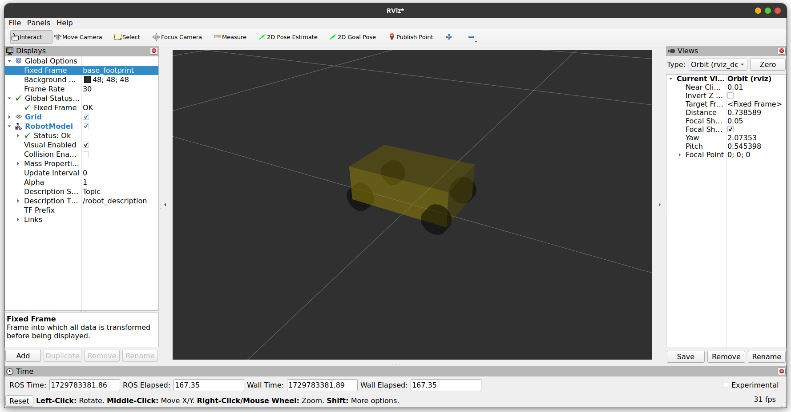

#### |--URDF优化xacro

Xacro 可以声明变量，可以通过数学运算求解；可以使用流程控制控制执行顺序；还可以通过宏封装、复用功能，从而提高代码复用率以及程序的安全性。

#### |--仿真

##### |--ros_control

**ros_control:**是一组软件包，它包含了控制器接口，控制器管理器，传输和硬件接口。ros_control 是一套机器人控制的中间件，是一套规范，不同的机器人平台只要按照这套规范实现，那么就可以保证 与ROS 程序兼容，通过这套规范，实现了一种可插拔的架构设计，大大提高了程序设计的效率与灵活性。

gazebo 已经实现了 ros_control 的相关接口，如果需要在 gazebo 中控制机器人运动，直接调用相关接口即可
