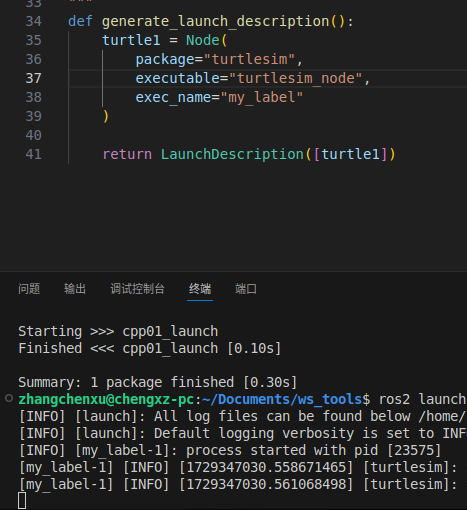

# 三、案例复现(猛狮集训营)

> 说明 Launch 文件中的节点、参数、文件包含、分组与事件配置。

[← 返回总目录](../../README.md) · [↑ 返回本章目录](README.md) · [← 上一节：3-6 可视化](06-visualization.md) · [下一节：3-8 通讯补充 →](08-communication-supplement.md)

---

## 3-7 Launch

WS_TOOLS

CMakeLists.txt 中添加语句：

```cmake
install(DIRECTORY launch DESTINATION share/${PROJECT_NAME})
```

注意命名规范

示例:启动两个``turtlesim_node``

```py
from launch import LaunchDescription
from launch_ros.actions import Node
# ---|封装终端指令相关类
# from launch.actions import ExecuteProcess
# from launch.substitutions import FindExecutable
# ---|参数声明与获取
# from launch.actions import DeclareLaunchArgument
# from launch.substitutions import LaunchConfiguration
# ---|文件包含相关
# from launch.action import IncludeLaunchDescription
# from launch.launch_description_sources import PythonLaunchDescriptionSource
# ---|分组相关
# from launch_ros.actions import PushRosNamespace
# from launch.actions import GroupAction
# ---|事件相关
# from launch.event_handlers import OnProcessStart, OnProcessExit
# from launch.actions import ExecuteProcess, RegisterEventHandler,LogInfo
# ---|获取功能包下 share 目录路径
# from ament_index_python.packages import get_package_share_directory

def generate_launch_description():
    # 功能包 可执行程序 
    t1 = Node(package="turtlesim",executable="turtlesim_node",name="t1")
    t2 = Node(package="turtlesim",executable="turtlesim_node",name="t2")

    return LaunchDescription([t1,t2])
```

### 3-7-1 节点设置

- `executable`：指定要执行的程序的名称，如果提供了包名，则在该包中查找可执行文件，否则视为可执行文件的路径。
- `package`：可选参数，指定包含节点可执行文件的包名。
- `name`：节点的名称。如果未指定（或为None），则使用节点代码中指定的默认名称。
- `namespace`：节点的ROS命名空间，可以是绝对路径（以'/'开头）或相对路径。如果是相对路径，将在LaunchConfiguration中指定的`ros_namespace`基础上构建。
- `exec_name`：用于标识进程的标签。默认为节点可执行文件的基本名称。
- `parameters`：参数列表，可以是包含参数规则的yaml文件名，或者是指定参数规则的字典。
- `remappings`：有序的'to'和'from'字符串对列表，表示要传递给节点的ROS重映射规则。
- `ros_arguments`：节点的ROS参数，等同于在`arguments`中添加了一个以'--ros-args'为前缀的项。
- `arguments`：节点的额外参数列表。

这个动作使用了`launch_ros.substitutions.ExecutableInPackage`替换来在运行时查找可执行文件，如果包或可执行文件未找到，会抛出异常。参数可以是yaml文件路径或参数字典，这些参数将被写入一个临时yaml文件，并将其路径传递给节点。

此外，如果提供了命名空间，字典中的参数会以前缀wildcard namespace（`/**`）开始，其他具体的参数声明可能会覆盖它。如果未指定`namespace`，则默认命名空间为`/`。

这个动作在执行时，大部分工作委托给`launch.actions.ExecuteProcess`类，但同时也会将一些ROS特定的参数转换为通用的命令行参数。这意味着，虽然很多参数最终会传递给`launch.actions.ExecuteProcess`，但这个动作还负责处理一些ROS特定的逻辑。


**exec_name**:

会使终端输出时，前面的信息发生变化



**ros_arguments**:

```py
def generate_launch_description():
    turtle1 = Node(
        package="turtlesim",
        executable="turtlesim_node",
        exec_name="my_label",
        ros_arguments=["--remap","__ns:=/t2"]
        # 等价于在终端输入 ros2 run turtlesim turtlesim_node --ros-args --remap __ns:=/t2 （修改命名空间）
        )
```


**parameters**:

```py
    turtle2 = Node(
        package="turtlesim",
        executable="turtlesim_node",
        name="HHHHHHHH",
        # 背景颜色改为红色 
        # 方式1 直接设置参数
        # parameters=[{"background_r":255,"background_g":0,"background_b":0}],
        # 方式2 参数保存在yaml文件中 通过绝对路径加载或相对路径
        parameters=["install/cpp01_launch/share/cpp01_launch/config/HHHHHHHH.yaml"]

        )
```

如何将参数导出至yaml文件中呢？

```bash
ros2 param dump HHHHHHHH --output-dir src/cpp01_launch/config
```

生成的yaml文件不能直接使用，需要在cmake文件修改，添加``config``

```cmake
install(DIRECTORY launch config DESTINATION share/${PROJECT_NAME})
```


**respawn**:如果程序因为异常关闭，可以自动重启

```py
        package="turtlesim",
        executable="turtlesim_node",
        respawn=True,
        name="HHHHHHHH",
```


### 3-7-2 执行指令

主要与``from launch.actions import ExecuteProcess``有关

```py
from launch import LaunchDescription
from launch_ros.actions import Node
# ---|封装终端指令相关类
from launch.actions import ExecuteProcess
# from launch.substitutions import FindExecutable
# ---|参数声明与获取
# from launch.actions import DeclareLaunchArgument
# from launch.substitutions import LaunchConfiguration
# ---|文件包含相关
# from launch.action import IncludeLaunchDescription
# from launch.launch_description_sources import PythonLaunchDescriptionSource
# ---|分组相关
# from launch_ros.actions import PushRosNamespace
# from launch.actions import GroupAction
# ---|事件相关
# from launch.event_handlers import OnProcessStart, OnProcessExit
# from launch.actions import ExecuteProcess, RegisterEventHandler,LogInfo
# ---|获取功能包下 share 目录路径
# from ament_index_python.packages import get_package_share_directory

"""
    启动turtlesim_node节点，调用指令打印乌龟位姿信息
"""
def generate_launch_description():
    t1 = Node(package="turtlesim",
              executable="turtlesim_node",
              name="t1")
    
    # 封装指令
    cmd = ExecuteProcess(
        cmd=["ros2 topic echo /turtle1/pose"],
        # 同时写入磁盘和终端
        output="both",
        # 当成终端指令执行
        shell=True
    )
    
    return LaunchDescription([t1,cmd])
```

此外亦可以通过``FindExecutable``封装

### 3-7-3 参数设置

主要与``from launch.actions import DeclareLaunchArgument和from launch.substitutions import LaunchConfiguration``有关的API。

```py
from launch import LaunchDescription
from launch_ros.actions import Node
# ---|封装终端指令相关类
# from launch.actions import ExecuteProcess
# from launch.substitutions import FindExecutable
# ---|参数声明与获取
from launch.actions import DeclareLaunchArgument
from launch.substitutions import LaunchConfiguration
# ---|文件包含相关
# from launch.action import IncludeLaunchDescription
# from launch.launch_description_sources import PythonLaunchDescriptionSource
# ---|分组相关
# from launch_ros.actions import PushRosNamespace
# from launch.actions import GroupAction
# ---|事件相关
# from launch.event_handlers import OnProcessStart, OnProcessExit
# from launch.actions import ExecuteProcess, RegisterEventHandler,LogInfo
# ---|获取功能包下 share 目录路径
# from ament_index_python.packages import get_package_share_directory
"""
    动态设置背景颜色
    1、声明launch中的参数（变量）；
    2、调用参数（调用变量）；
    3、执行launch时动态导入参数；
"""
def generate_launch_description():
    # 1.声明参数（变量）
    bg_r = DeclareLaunchArgument("backg_r",default_value="255")
    # 2.调用参数（变量）
    t1 = Node(
        package="turtlesim",
        executable="turtlesim_node",
        parameters=[{"background_r":LaunchConfiguration("backg_r")}]
    )
    
    # 传入列表
    return LaunchDescription([bg_r,t1])
```


### 3-7-4 文件包含

在 launch 文件中可以包含其他 launch 文件，需要使用的 API 为：``launch.actions.IncludeLaunchDescription`` 和
``aunch.launch_description_sources.PythonLaunchDescriptionSource``。

```py
from launch import LaunchDescription
from launch_ros.actions import Node
# ---|封装终端指令相关类
# from launch.actions import ExecuteProcess
# from launch.substitutions import FindExecutable
# ---|参数声明与获取
# from launch.actions import DeclareLaunchArgument
# from launch.substitutions import LaunchConfiguration
# ---|文件包含相关
from launch.actions import IncludeLaunchDescription
from launch.launch_description_sources import PythonLaunchDescriptionSource
# ---|分组相关
# from launch_ros.actions import PushRosNamespace
# from launch.actions import GroupAction
# ---|事件相关
# from launch.event_handlers import OnProcessStart, OnProcessExit
# from launch.actions import ExecuteProcess, RegisterEventHandler,LogInfo
# ---|获取功能包下 share 目录路径
# from ament_index_python.packages import get_package_share_directory

"""
    在当前launch文件包含其他launch文件
"""
def generate_launch_description():
    include1 = IncludeLaunchDescription(
        launch_description_source=PythonLaunchDescriptionSource(
            launch_file_path="install/cpp01_launch/share/cpp01_launch/launch/py/py04_args_launch.py"
        )
        # 也可以直接传参
    )
    include2 = IncludeLaunchDescription(
        launch_description_source=PythonLaunchDescriptionSource(
            launch_file_path="install/cpp01_launch/share/cpp01_launch/launch/py/py03_cmd_launch.py"
        )
    )
        # 也可以直接传参
    
    return LaunchDescription([include1,include2])
```


### 3-7-4  分组设置

使用的API为``from launch_ros.actions import PushRosNamespace``和``from launch.actions import GroupAction``

```py
from launch import LaunchDescription
from launch_ros.actions import Node
# ---|封装终端指令相关类
# from launch.actions import ExecuteProcess
# from launch.substitutions import FindExecutable
# ---|参数声明与获取
# from launch.actions import DeclareLaunchArgument
# from launch.substitutions import LaunchConfiguration
# ---|文件包含相关
# from launch.actions import IncludeLaunchDescription
# from launch.launch_description_sources import PythonLaunchDescriptionSource
# ---|分组相关
from launch_ros.actions import PushRosNamespace
from launch.actions import GroupAction
# ---|事件相关
# from launch.event_handlers import OnProcessStart, OnProcessExit
# from launch.actions import ExecuteProcess, RegisterEventHandler,LogInfo
# ---|获取功能包下 share 目录路径
# from ament_index_python.packages import get_package_share_directory
"""
    创建三个turtlesim_node，将前两个划分为一组，第三个单独一组
"""

def generate_launch_description():
    # 创建三个 turtlesim_node
    t1 = Node(package="turtlesim",executable="turtlesim_node",name="t1")
    t2 = Node(package="turtlesim",executable="turtlesim_node",name="t2")
    t3 = Node(package="turtlesim",executable="turtlesim_node",name="t3")
    # 分组
    # 设置当前组的命名空间，以及包含的节点
    g1 = GroupAction(actions=[PushRosNamespace("g1_nw"),t1,t2])
    g2 = GroupAction(actions=[PushRosNamespace("g2_nw"),t3])
    return LaunchDescription([g1,g2])
```


### 3-7-5  添加事件

主要涉及``from launch.event_handlers import OnProcessStart, OnProcessExit``和``from launch.actions import ExecuteProcess, RegisterEventHandler,LogInfo``

```py
from launch import LaunchDescription
from launch_ros.actions import Node
# ---|封装终端指令相关类
from launch.actions import ExecuteProcess
# from launch.substitutions import FindExecutable
# ---|参数声明与获取
# from launch.actions import DeclareLaunchArgument
# from launch.substitutions import LaunchConfiguration
# ---|文件包含相关
# from launch.actions import IncludeLaunchDescription
# from launch.launch_description_sources import PythonLaunchDescriptionSource
# ---|分组相关
# from launch_ros.actions import PushRosNamespace
# from launch.actions import GroupAction
# ---|事件相关
from launch.event_handlers import OnProcessStart, OnProcessExit
from launch.actions import ExecuteProcess, RegisterEventHandler,LogInfo
# ---|获取功能包下 share 目录路径
# from ament_index_python.packages import get_package_share_directory

"""
    为 turtlesim_node 绑定事件，节点启动时，执行生成新的乌龟的程序，节点关闭执行日志输出
"""
def generate_launch_description():
    turtle = Node(
        package="turtlesim",
        executable="turtlesim_node"
    )
    spawn = ExecuteProcess(
        cmd=["ros2 service call /spawn turtlesim/srv/Spawn \"{'x': 8.0,'y': 3.0}\""],
        output="both",
        shell=True
    )
    # 注册事件1
    event_start = RegisterEventHandler(
        # 事件源 和 操作
        event_handler=OnProcessStart(
            target_action=turtle,
            on_start=spawn
        )
    )
    # 注册事件2 
    enent_exit = RegisterEventHandler(
        event_handler=OnProcessExit(
            target_action=turtle,
            on_exit=[LogInfo(msg="turtlesim_node 退出！")]
        )
    )
    return LaunchDescription([turtle,event_start,enent_exit])
```
