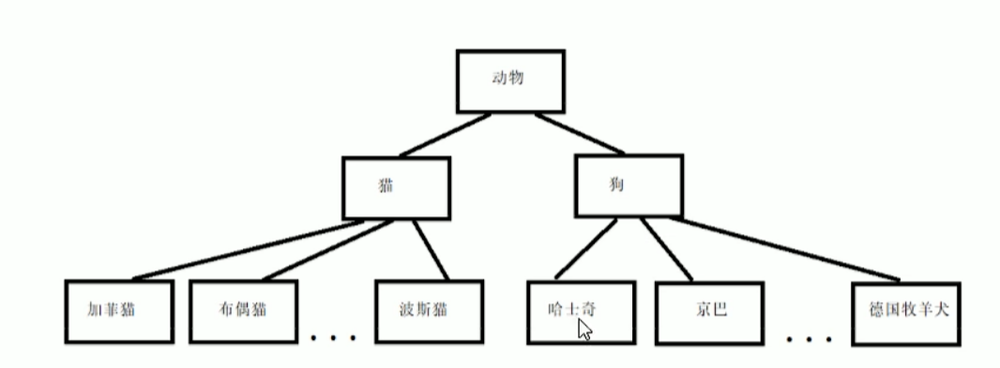
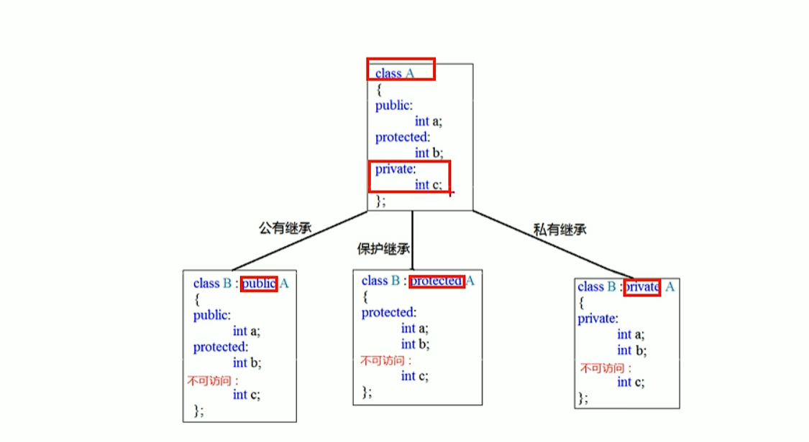

# 五、C++相关

> 整理内存模型、引用、函数、类与对象、this 指针和继承等核心主题。

[← 返回总目录](../../README.md) · [↑ 返回本章目录](README.md) · [← 上一节：5-1 CMake](01-cmake.md)

---

## 5-2 C++核心编程

### 5-2-1 内存分区模型

C++程序在执行时，将内存大方向划分为**4个区域**

- 代码区：存放函数体的二进制代码，由操作系统进行管理的
- 全局区：存放全局变量和静态变量以及常量
- 栈区：由编译器自动分配释放, 存放函数的参数值,局部变量等
- 堆区：由程序员分配和释放,若程序员不释放,程序结束时由操作系统回收

不同区域存放的数据，赋予不同的生命周期, 给我们更大的灵活编程

**代码区：**

​		存放 CPU 执行的机器指令

​		代码区是**共享**的，共享的目的是对于频繁被执行的程序，只需要在内存中有一份代码即可

​		代码区是**只读**的，使其只读的原因是防止程序意外地修改了它的指令

​	**全局区：**

​		全局变量和静态变量存放在此.

​		全局区还包含了常量区, 字符串常量和其他常量也存放在此.

```cpp
//全局变量
int g_a = 10;
int g_b = 10;

//全局常量
const int c_g_a = 10;
const int c_g_b = 10;

int main() {

	//局部变量
	int a = 10;
	int b = 10;

	//打印地址
	cout << "局部变量a地址为： " << (int)&a << endl;
	cout << "局部变量b地址为： " << (int)&b << endl;

	cout << "全局变量g_a地址为： " <<  (int)&g_a << endl;
	cout << "全局变量g_b地址为： " <<  (int)&g_b << endl;

	//静态变量
	static int s_a = 10;
	static int s_b = 10;

	cout << "静态变量s_a地址为： " << (int)&s_a << endl;
	cout << "静态变量s_b地址为： " << (int)&s_b << endl;

	cout << "字符串常量地址为： " << (int)&"hello world" << endl;
	cout << "字符串常量地址为： " << (int)&"hello world1" << endl;

	cout << "全局常量c_g_a地址为： " << (int)&c_g_a << endl;
	cout << "全局常量c_g_b地址为： " << (int)&c_g_b << endl;

	const int c_l_a = 10;
	const int c_l_b = 10;
	cout << "局部常量c_l_a地址为： " << (int)&c_l_a << endl;
	cout << "局部常量c_l_b地址为： " << (int)&c_l_b << endl;

	system("pause");

	return 0;
}
```

总结：

* C++中在程序运行前分为全局区和代码区
* 代码区特点是共享和只读
* 全局区中存放全局变量、静态变量、常量
* 常量区中存放 const修饰的全局常量  和 字符串常量

### 5-2-2 引用

**作用： **给变量起别名

**语法：** `数据类型 &别名 = 原名`

**引用注意事项**

* 引用必须初始化
* 引用在初始化后，不可以改变

```C++
int main() {

	int a = 10;
	int b = 20;
	//int &c; //错误，引用必须初始化
	int &c = a; //一旦初始化后，就不可以更改
	c = b; //这是赋值操作，不是更改引用

	cout << "a = " << a << endl;
	cout << "b = " << b << endl;
	cout << "c = " << c << endl;

	system("pause");

	return 0;
}
```

### 5-2-3 函数高级

#### 函数默认参数

在C++中，函数的形参列表中的形参是可以有默认值的。

语法：` 返回值类型  函数名 （参数= 默认值）{}`

- 如果某个位置参数有默认值，那么从这个位置往后，从左向右，必须都要有默认值
-  如果函数声明有默认值，函数实现的时候就不能有默认参数

#### 函数占位参数

C++中函数的形参列表里可以有占位参数，用来做占位，调用函数时必须填补该位置

**语法：** `返回值类型 函数名 (数据类型){}`

```C++
//函数占位参数 ，占位参数也可以有默认参数
void func(int a, int) {
	cout << "this is func" << endl;
}

int main() {

	func(10,10); //占位参数必须填补

	system("pause");

	return 0;
}
```

#### 函数重载

**作用：**函数名可以相同，提高复用性

**函数重载满足条件：**

* 同一个作用域下
* 函数名称相同
* 函数参数**类型不同**  或者 **个数不同** 或者 **顺序不同**

``` C++
//函数重载需要函数都在同一个作用域下
void func()
{
	cout << "func 的调用！" << endl;
}
void func(int a)
{
	cout << "func (int a) 的调用！" << endl;
}
void func(double a)
{
	cout << "func (double a)的调用！" << endl;
}
void func(int a ,double b)
{
	cout << "func (int a ,double b) 的调用！" << endl;
}
void func(double a ,int b)
{
	cout << "func (double a ,int b)的调用！" << endl;
}

//函数返回值不可以作为函数重载条件
//int func(double a, int b)
//{
//	cout << "func (double a ,int b)的调用！" << endl;
//}


int main() {

	func();
	func(10);
	func(3.14);
	func(10,3.14);
	func(3.14 , 10);
	
	system("pause");

	return 0;
}
```


###  5-2-4 类和对象

C++面向对象的三大特性为：==封装、继承、多态==

C++认为==万事万物都皆为对象==，对象上有其属性和行为

#### 封装

封装是C++面向对象三大特性之一

封装的意义：

* 将属性和行为作为一个整体，表现生活中的事物
* 将属性和行为加以权限控制

**封装意义一：**

​	在设计类的时候，属性和行为写在一起，表现事物

**语法：** `class 类名{   访问权限： 属性  / 行为  };`

**示例1：**设计一个圆类，求圆的周长

**示例代码：**

```C++
//圆周率
const double PI = 3.14;

//1、封装的意义
//将属性和行为作为一个整体，用来表现生活中的事物

//封装一个圆类，求圆的周长
//class代表设计一个类，后面跟着的是类名
class Circle
{
public:  //访问权限  公共的权限

	//属性
	int m_r;//半径

	//行为
	//获取到圆的周长
	double calculateZC()
	{
		//2 * pi  * r
		//获取圆的周长
		return  2 * PI * m_r;
	}
};

int main() {

	//通过圆类，创建圆的对象
	// c1就是一个具体的圆
	Circle c1;
	c1.m_r = 10; //给圆对象的半径 进行赋值操作

	//2 * pi * 10 = = 62.8
	cout << "圆的周长为： " << c1.calculateZC() << endl;

	system("pause");

	return 0;
}
```


类在设计时，可以把属性和行为放在不同的权限下，加以控制

访问权限有三种：

1. public        公共权限  
2. protected 保护权限 被标记为protected的成员可以被同一类中的其他成员（包括成员函数）和其**子类**中的成员访问
3. private      私有权限 被标记为private的成员只能由同一类中的其他成员（包括成员函数）访问。

```C++
//三种权限
//公共权限  public     类内可以访问  类外可以访问
//保护权限  protected  类内可以访问  类外不可以访问
//私有权限  private    类内可以访问  类外不可以访问

class Person
{
	//姓名  公共权限
public:
	string m_Name;

	//汽车  保护权限
protected:
	string m_Car;

	//银行卡密码  私有权限
private:
	int m_Password;

public:
	void func()
	{
		m_Name = "张三";
		m_Car = "拖拉机";
		m_Password = 123456;
	}
};

int main() {

	Person p;
	p.m_Name = "李四";
	//p.m_Car = "奔驰";  //保护权限类外访问不到
	//p.m_Password = 123; //私有权限类外访问不到

	system("pause");

	return 0;
}
```

**struct和class区别**

在C++中 struct和class唯一的**区别**就在于 **默认的访问权限不同**

区别：

* struct 默认权限为公共
* class   默认权限为私有

```cpp
class C1
{
	int  m_A; //默认是私有权限
};

struct C2
{
	int m_A;  //默认是公共权限
};

int main() {

	C1 c1;
	c1.m_A = 10; //错误，访问权限是私有

	C2 c2;
	c2.m_A = 10; //正确，访问权限是公共

	system("pause");

	return 0;
}
```


**成员属性设置为私有**

**优点1：**将所有成员属性设置为私有，可以自己控制读写权限

**优点2：**对于写权限，我们可以检测数据的有效性

```cpp
class Person {
public:

	//姓名设置可读可写
	void setName(string name) {
		m_Name = name;
	}
	string getName()
	{
		return m_Name;
	}


	//获取年龄 
	int getAge() {
		return m_Age;
	}
	//设置年龄
	void setAge(int age) {
		if (age < 0 || age > 150) {
			cout << "你个老妖精!" << endl;
			return;
		}
		m_Age = age;
	}

	//情人设置为只写
	void setLover(string lover) {
		m_Lover = lover;
	}

private:
	string m_Name; //可读可写  姓名
	
	int m_Age; //只读  年龄

	string m_Lover; //只写  情人
};


int main() {

	Person p;
	//姓名设置
	p.setName("张三");
	cout << "姓名： " << p.getName() << endl;

	//年龄设置
	p.setAge(50);
	cout << "年龄： " << p.getAge() << endl;

	//情人设置
	p.setLover("苍井");
	//cout << "情人： " << p.m_Lover << endl;  //只写属性，不可以读取

	system("pause");

	return 0;
}
```


#### 对象的初始化和清理

* 构造函数：主要作用在于创建对象时为对象的成员属性赋值，构造函数由编译器自动调用，无须手动调用。
* 析构函数：主要作用在于对象**销毁前**系统自动调用，执行一些清理工作。


**构造函数语法：**`类名(){}`

1. 构造函数，**没有返回值也不写void**
2. **函数名称与类名相同**
3. 构造函数可以有参数，因此可以发生重载
4. 程序在调用对象时候会自动调用构造，无须手动调用,而且只会调用一次

**析构函数语法：** `~类名(){}`

1. 析构函数，没有返回值也不写void
2. 函数名称与类名相同,在名称前加上符号  ~
3. 析构函数不可以有参数，因此不可以发生重载
4. 程序在对象销毁前会自动调用析构，无须手动调用,而且只会调用一次

```C++
class Person
{
public:
	//构造函数
	Person()
	{
		cout << "Person的构造函数调用" << endl;
	}
	//析构函数
	~Person()
	{
		cout << "Person的析构函数调用" << endl;
	}

};

void test01()
{
	Person p;
}

int main() {
	
	test01();

	system("pause");

	return 0;
}
```


**初始化列表**

**作用：**

C++提供了初始化列表语法，用来初始化属性

**语法：**`构造函数()：属性1(值1),属性2（值2）... {}`

```C++

class Person {
public:

	////传统方式初始化
	//Person(int a, int b, int c) {
	//	m_A = a;
	//	m_B = b;
	//	m_C = c;
	//}

	//初始化列表方式初始化
	Person(int a, int b, int c) :m_A(a), m_B(b), m_C(c) {}
	void PrintPerson() {
		cout << "mA:" << m_A << endl;
		cout << "mB:" << m_B << endl;
		cout << "mC:" << m_C << endl;
	}
private:
	int m_A;
	int m_B;
	int m_C;
};

int main() {

	Person p(1, 2, 3);
	p.PrintPerson();


	system("pause");

	return 0;
}
```


静态成员就是在成员变量和成员函数前加上关键字static，称为静态成员

静态成员分为：

*  静态成员变量
   *  所有对象共享同一份数据
   *  在编译阶段分配内存
   *  类内声明，类外初始化
*  静态成员函数
   *  所有对象共享同一个函数
   *  静态成员函数只能访问静态成员变量

```C++
class Person
{
	
public:

	static int m_A; //静态成员变量

	//静态成员变量特点：
	//1 在编译阶段分配内存
	//2 类内声明，类外初始化
	//3 所有对象共享同一份数据

private:
	static int m_B; //静态成员变量也是有访问权限的
};

// 类外初始化
int Person::m_A = 10;
int Person::m_B = 10;

void test01()
{
	//静态成员变量两种访问方式

	//1、通过对象
	Person p1;
	p1.m_A = 100;
	cout << "p1.m_A = " << p1.m_A << endl;

	Person p2;
	p2.m_A = 200;
	cout << "p1.m_A = " << p1.m_A << endl; //共享同一份数据
	cout << "p2.m_A = " << p2.m_A << endl;

	//2、通过类名
	cout << "m_A = " << Person::m_A << endl;


	//cout << "m_B = " << Person::m_B << endl; //私有权限访问不到
}

int main() {

	test01();

	system("pause");

	return 0;
}
```


### 5-2-5  C++对象模型和this指针

#### 成员变量和成员函数分开存储

在C++中，类内的成员变量和成员函数分开存储

只有非静态成员变量才属于类的对象上

```C++
class Person {
public:
	Person() {
		mA = 0;
	}
	//非静态成员变量占对象空间
	int mA;
	//静态成员变量不占对象空间
	static int mB; 
	//函数也不占对象空间，所有函数共享一个函数实例
	void func() {
		cout << "mA:" << this->mA << endl;
	}
	//静态成员函数也不占对象空间
	static void sfunc() {
	}
};

int main() {

	cout << sizeof(Person) << endl;

	system("pause");

	return 0;
}
```


#### this指针概念

每一个非静态成员函数只会诞生一份函数实例，也就是说多个同类型的对象会共用一块代码

那么问题是：这一块代码是如何区分那个对象调用自己的呢？

c++通过提供特殊的对象指针，this指针，解决上述问题。**this指针指向被调用的成员函数所属的对象**

this指针是隐含每一个非静态成员函数内的一种指针

this指针不需要定义，直接使用即可


this指针的用途：

*  当形参和成员变量同名时，可用this指针来区分
*  在类的非静态成员函数中返回对象本身，可使用return *this


this指针指向的是被调用的成员所属的对象

下面这个为例：

当代码到``Person p1(10)``时，调用了``Person(int age)``这个有参构造函数，``this``指针指向的是被调用的成员函数``p1``,即``p1``在调用这个函数，指向的就是``p1``。

```cpp
class Person
{
public:

	Person(int age)
	{
		//1、当形参和成员变量同名时，可用this指针来区分
		this->age = age;
	}

	int age;
};

void test01()
{
	Person p1(10);
	cout << "p1.age = " << p1.age << endl;
}

int main() {

	test01();

	system("pause");

	return 0;
}
```


```cpp
class Person
{
public:

	Person(int age)
	{
		//1、当形参和成员变量同名时，可用this指针来区分
		this->age = age;
	}

	Person& PersonAddPerson(Person p)
	{
		this->age += p.age;
		//返回对象本身
		return *this;
	}

	int age;
};

void test01()
{
	Person p1(10);
	cout << "p1.age = " << p1.age << endl;

	Person p2(10);
	p2.PersonAddPerson(p1).PersonAddPerson(p1).PersonAddPerson(p1);
	cout << "p2.age = " << p2.age << endl;
}

int main() {

	test01();

	system("pause");

	return 0;
}
```


#### const修饰成员函数

**常函数：**

* 成员函数后加const后我们称为这个函数为**常函数**
* 常函数内不可以修改成员属性
* 成员属性声明时加关键字mutable后，在常函数中依然可以修改

**常对象：**

* 声明对象前加const称该对象为常对象
* 常对象只能调用常函数


```cpp
class Person {
public:
	Person() {
		m_A = 0;
		m_B = 0;
	}

	//this指针的本质是一个指针常量，指针的指向不可修改
	//如果想让指针指向的值也不可以修改，需要声明常函数
	void ShowPerson() const {
		//const Type* const pointer;
		//this = NULL; //不能修改指针的指向 Person* const this;
		//this->mA = 100; //但是this指针指向的对象的数据是可以修改的

		//const修饰成员函数，表示指针指向的内存空间的数据不能修改，除了mutable修饰的变量
		this->m_B = 100;
	}

	void MyFunc() const {
		//mA = 10000;
	}

public:
	int m_A;
	mutable int m_B; //可修改 可变的
};


//const修饰对象  常对象
void test01() {

	const Person person; //常量对象  
	cout << person.m_A << endl;
	//person.mA = 100; //常对象不能修改成员变量的值,但是可以访问
	person.m_B = 100; //但是常对象可以修改mutable修饰成员变量

	//常对象访问成员函数
	person.MyFunc(); //常对象不能调用const的函数

}

int main() {

	test01();

	system("pause");

	return 0;
}
```


#### 继承



定义这些类时，下级别的成员除了拥有上一级的共性，还有自己的特性，这个时候我们就可以考虑利用继承的技术，减少重复代码。

**继承的基本语法**

​	**普通实现：**

```cpp
//Java页面
class Java 
{
public:
	void header()
	{
		cout << "首页、公开课、登录、注册...（公共头部）" << endl;
	}
	void footer()
	{
		cout << "帮助中心、交流合作、站内地图...(公共底部)" << endl;
	}
	void left()
	{
		cout << "Java,Python,C++...(公共分类列表)" << endl;
	}
	void content()
	{
		cout << "JAVA学科视频" << endl;
	}
};
//Python页面
class Python
{
public:
	void header()
	{
		cout << "首页、公开课、登录、注册...（公共头部）" << endl;
	}
	void footer()
	{
		cout << "帮助中心、交流合作、站内地图...(公共底部)" << endl;
	}
	void left()
	{
		cout << "Java,Python,C++...(公共分类列表)" << endl;
	}
	void content()
	{
		cout << "Python学科视频" << endl;
	}
};
//C++页面
class CPP 
{
public:
	void header()
	{
		cout << "首页、公开课、登录、注册...（公共头部）" << endl;
	}
	void footer()
	{
		cout << "帮助中心、交流合作、站内地图...(公共底部)" << endl;
	}
	void left()
	{
		cout << "Java,Python,C++...(公共分类列表)" << endl;
	}
	void content()
	{
		cout << "C++学科视频" << endl;
	}
};

void test01()
{
	//Java页面
	cout << "Java下载视频页面如下： " << endl;
	Java ja;
	ja.header();
	ja.footer();
	ja.left();
	ja.content();
	cout << "--------------------" << endl;

	//Python页面
	cout << "Python下载视频页面如下： " << endl;
	Python py;
	py.header();
	py.footer();
	py.left();
	py.content();
	cout << "--------------------" << endl;

	//C++页面
	cout << "C++下载视频页面如下： " << endl;
	CPP cp;
	cp.header();
	cp.footer();
	cp.left();
	cp.content();

}

int main() {

	test01();

	system("pause");

	return 0;
}
```

​	**继承实现：**

```cpp
//公共页面
class BasePage
{
public:
	void header()
	{
		cout << "首页、公开课、登录、注册...（公共头部）" << endl;
	}

	void footer()
	{
		cout << "帮助中心、交流合作、站内地图...(公共底部)" << endl;
	}
	void left()
	{
		cout << "Java,Python,C++...(公共分类列表)" << endl;
	}

};

//Java页面
class Java : public BasePage
{
public:
	void content()
	{
		cout << "JAVA学科视频" << endl;
	}
};
//Python页面
class Python : public BasePage
{
public:
	void content()
	{
		cout << "Python学科视频" << endl;
	}
};
//C++页面
class CPP : public BasePage
{
public:
	void content()
	{
		cout << "C++学科视频" << endl;
	}
};

void test01()
{
	//Java页面
	cout << "Java下载视频页面如下： " << endl;
	Java ja;
	ja.header();
	ja.footer();
	ja.left();
	ja.content();
	cout << "--------------------" << endl;

	//Python页面
	cout << "Python下载视频页面如下： " << endl;
	Python py;
	py.header();
	py.footer();
	py.left();
	py.content();
	cout << "--------------------" << endl;

	//C++页面
	cout << "C++下载视频页面如下： " << endl;
	CPP cp;
	cp.header();
	cp.footer();
	cp.left();
	cp.content();
}

int main() {

	test01();

	system("pause");

	return 0;
}
```

**继承方式一共有三种：**

* 公共继承
* 保护继承
* 私有继承



```cpp
class Base1
{
public: 
	int m_A;
protected:
	int m_B;
private:
	int m_C;
};

//公共继承
class Son1 :public Base1
{
public:
	void func()
	{
		m_A; //可访问 public权限
		m_B; //可访问 protected权限
		//m_C; //不可访问
	}
};

void myClass()
{
	Son1 s1;
	s1.m_A; //其他类只能访问到公共权限
}

//保护继承
class Base2
{
public:
	int m_A;
protected:
	int m_B;
private:
	int m_C;
};
class Son2:protected Base2
{
public:
	void func()
	{
		m_A; //可访问 protected权限
		m_B; //可访问 protected权限
		//m_C; //不可访问
	}
};
void myClass2()
{
	Son2 s;
	//s.m_A; //不可访问
}

//私有继承
class Base3
{
public:
	int m_A;
protected:
	int m_B;
private:
	int m_C;
};
class Son3:private Base3
{
public:
	void func()
	{
		m_A; //可访问 private权限
		m_B; //可访问 private权限
		//m_C; //不可访问
	}
};
class GrandSon3 :public Son3
{
public:
	void func()
	{
		//Son3是私有继承，所以继承Son3的属性在GrandSon3中都无法访问到
		//m_A;
		//m_B;
		//m_C;
	}
};
```
