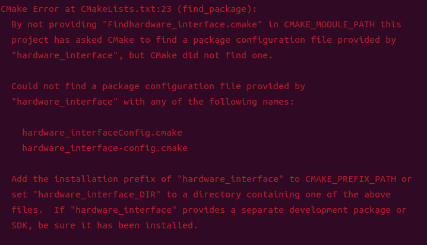
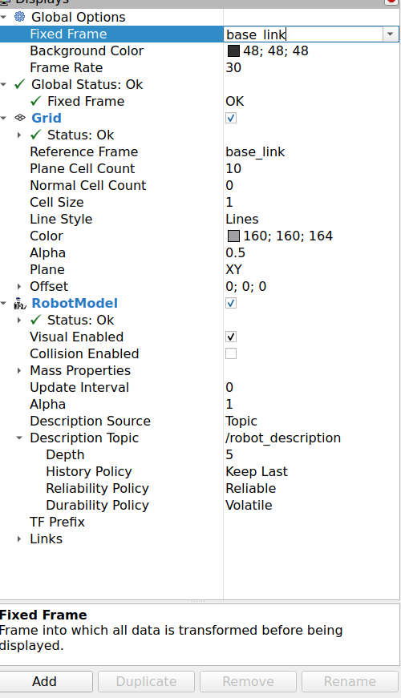
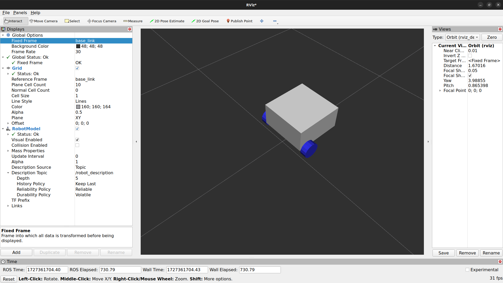
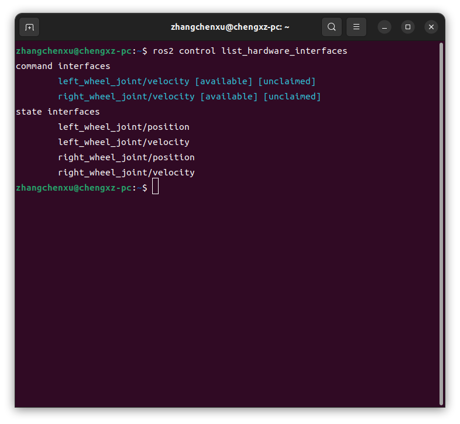
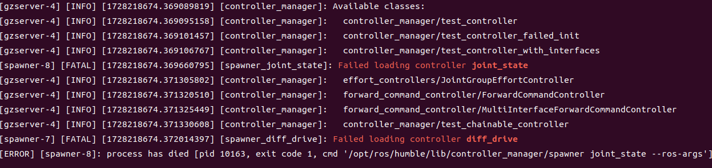
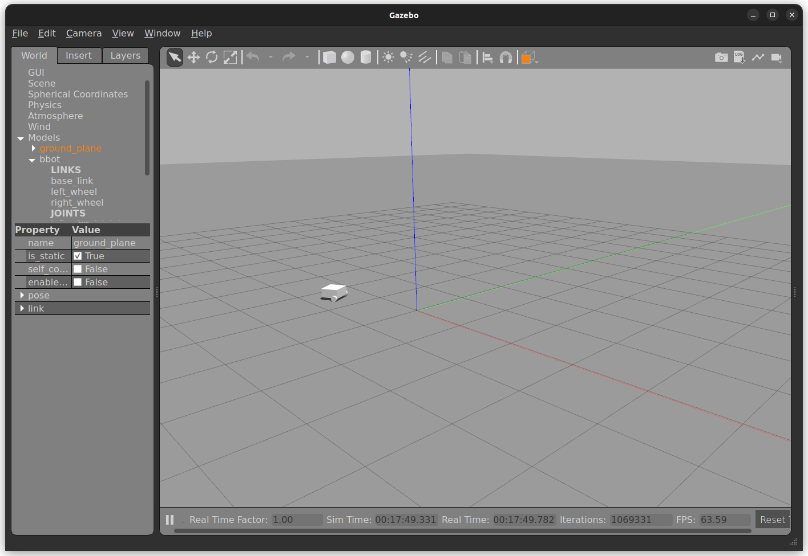

# 六、Ros2_contral

> 说明控制器与硬件接口的配置、调用和运行流程。

[← 返回总目录](../../README.md) · [↑ 返回本章目录](README.md) · [← 上一节：6-1 概论](01-overview.md) · [下一节：6-3 常用ros2_control标签 →](03-common-tags.md)

---

## 6-2 调用controllers和hardware_interfaces

下载该项目：

https://github.com/WMGIII/bbot_demo

在工作空间下编译，如果报错



则下载：

```bash 
sudo apt-get install ros-humble-effort-controllers
```

之后运行：

```bash
ros2 launch bbot_description  bbot.launch.py
```

按照下图配置并加入插件：



可以得到：



**之后使用ros2_contral**框架构建**gazebo**下的模型

可以参考：https://github.com/ros-controls/roadmap/blob/master/design_drafts/hardware_access.md

**--相关概念--**

在ROS 2中，硬件资源（hardware resources）是物理硬件的抽象，它们实现了与物理硬件的通信，并作为插件被导出。硬件资源可以通过URDF文件来配置，并且在运行时被动态加载，从而允许灵活和动态地组合要控制的设置。

硬件资源主要有三种类型：

1. **Actuator（执行器）**：简单的1自由度（1 DOF）机器人硬件，如电机或阀门。
2. **System（系统）**：复杂的多自由度（multi-DOF）机器人硬件，如工业机器人。
3. **Sensor（传感器）**：用于感知环境的机器人硬件，可以与关节（例如，编码器）或链接（例如，力-扭矩传感器）相关。

执行器和系统组件具有读写能力（使用joint接口），而传感器组件仅具有读取能力（使用sensor接口）。

```xml
<ros2_control name="my_simple_servo_motor" type="actuator">
  <hardware>
    <class>simple_servo_motor_pkg/SimpleServoMotor</class>
    <param name="serial_port">/dev/tty0</param>
    <!-- ... -->
  </hardware>
  <joint name="joint1">
    <command_interface name="position">
      <param name="min">-1.57</param>
      <param name="max">1.57</param>
    </command>
    <state_interface name="position"/>
    <!-- ... -->
  </joint>
</ros2_control>
```

在上述示例中，`<ros2_control>`标签定义了硬件资源的名称和类型，`<hardware>`标签指定了硬件接口的插件和参数，而`<joint>`标签定义了与执行器相关联的关节，包括命令接口和状态接口。

硬件资源的管理是通过资源管理器（Resource Manager）进行的，它使用pluginlib库动态加载组件，并管理它们的生命周期和状态。在控制循环执行中，资源管理器的`read()`和`write()`方法处理与硬件组件的通信。

之后在URDF目录下创建``bbot.ros2_control.xacro``

```xaml
<?xml version="1.0"?>
<robot xmlns:xacro="test">
    <xacro:macro name="bbot_ros2_control">
        <ros2_control name="bbot_hardware_interface" type="system">
            <!-- 在声明hardware_resource时需要在此处声明 -->
             <hardware>
                <plugin>gazebo_ros2_control/GazeboSystem</plugin>
             </hardware>

             <joint name="left_wheel_joint">
                <command_interface name="velocity">
                    <param name="min">-10</param>
                    <param name="max">10</param>                
                </command_interface>


                <state_interface name="position"/>
                <state_interface name="velocity"/>

             </joint>

             <joint name="right_wheel_joint">
                <command_interface name="velocity">
                    <param name="min">-10</param>
                    <param name="max">10</param>
                </command_interface>


                <state_interface name="position"/>
                <state_interface name="velocity"/>

             </joint>

        </ros2_control>

        <!-- 使用gazebo -->
        <gazebo>
        <plugin filename="libgazebo_ros2_control.so" name="gazebo_ros2_control">
            <parameters>$(find bbot_bringup)/config/bbot_controllers.yaml</parameters>
        </plugin>
        </gazebo>
    </xacro:macro>
    
</robot>

```


另外创建一个``bbot_bringup``文件夹，其中创建``config``和``launch``文件夹

``config``文件夹下创建``bbot_controllers.yaml``文件

```yaml
controller_manager:
  ros__parameters:
    update_rate: 30
    use_sim_time: true

    # 自定义的参数
    diff_drive:
      type: diff_drive_controller/DiffDriveController

    joint_state:
      type: joint_state_broadcaster/JointStateBroadcaster


diff_drive:
  ros__parameters:
    publish_rate: 50.0
    base_frame_id: base_link

    left_wheel_names: ['left_wheel_joint']
    right_wheel_names: ['right_wheel_joint']
    # 轮距
    wheel_separation: 0.35
    # 轮子的半径
    wheel_radius: 0.05

    use_stamped_vel: false

```


``launch``文件夹下创建``bbot_bringup.launch.py``文件

```python
import os
# ---|获取功能包下 share 目录路径
from ament_index_python.packages import get_package_share_directory
from launch import LaunchDescription
from launch_ros.actions import Node
# ---|封装终端指令相关类
# from launch.actions import ExecuteProcess
# from launch.substitutions import FindExecutable
# ---|参数声明与获取
# from launch.actions import DeclareLaunchArgument
# from launch.substitutions import LaunchConfiguration
# ---|文件包含相关
from launch.actions import IncludeLaunchDescription
from launch.launch_description_sources import PythonLaunchDescriptionSource
# ---|分组相关
# from launch_ros.actions import PushRosNamespace
# from launch.actions import GroupAction
# ---|事件相关
# from launch.event_handlers import OnProcessStart, OnProcessExit
# from launch.actions import ExecuteProcess, RegisterEventHandler,LogInfo


def generate_launch_description():
    package_name='bbot_description'

    bbot = IncludeLaunchDescription(
                PythonLaunchDescriptionSource([os.path.join(
                    get_package_share_directory(package_name), 'launch', 'bbot.launch.py'    
                    )]), launch_arguments={'use_sim_time': 'true'}.items()
            )

    gazebo = IncludeLaunchDescription(
                PythonLaunchDescriptionSource([os.path.join(
                    get_package_share_directory('gazebo_ros'), 'launch', 'gazebo.launch.py'
                )]),
            )
    spawn_entity = Node(
        package='gazebo_ros', 
        executable='spawn_entity.py',
        arguments=['-topic', 'robot_description', '-entity', 'bbot'],
        output='screen')
    
    joint_broad_spawner = Node(
        package="controller_manager",
        executable="spawner",
        arguments=["joint_state"],
    )
    diff_drive_spawner = Node(
        package="controller_manager",
        executable="spawner",
        arguments=["diff_drive"],
    )
    
    return LaunchDescription([
        bbot,
        gazebo,
        spawn_entity,
        diff_drive_spawner,
        joint_broad_spawner,
    ])
```


编译后启动``launch``文件,如果报错，或者显示无法连接`/controller_manager/list_controllers`服务，则安装以下功能包：

```bash
sudo apt-get install ros-humble-controller-manager
sudo apt install ros-humble-ros2-control
sudo apt-get install ros-humble-gazebo-ros2-control
sudo apt install ros-humble-gazebo-ros-pkgs
```


之后运行

```bash
ros2 control list_hardware_interfaces
```

可以查看所有的``hardware_interfaces``



如果日志中提示：



1. **控制器加载失败**：

   - `[ERROR] [controller_manager]: Loader for controller 'diff_drive' (type 'diff_drive_controller/DiffDriveController') not found.`
   - `[ERROR] [controller_manager]: Loader for controller 'joint_state' (type 'joint_state_broadcaster/JointStateBroadcaster') not found.`

   这表明ROS 2无法找到`diff_drive_controller`和`joint_state_broadcaster`控制器的加载器。这通常是因为没有安装相应的ROS 2包或者环境没有配置正确。

2. **过时的QoS设置**：

   - `[spawn_entity.py-6] /opt/ros/humble/local/lib/python3.10/dist-packages/rclpy/qos.py:307: UserWarning: DurabilityPolicy.RMW_QOS_POLICY_DURABILITY_TRANSIENT_LOCAL is deprecated. Use DurabilityPolicy.TRANSIENT_LOCAL instead.`

   这是一个警告，表明你使用的QoS设置已经过时，建议更新为新的设置。

3. **控制器管理器错误**：

   - `[FATAL] [spawner_diff_drive]: Failed loading controller diff_drive`
   - `[FATAL] [spawner_joint_state]: Failed loading controller joint_state`

   这些错误表明控制器加载失败，导致进程退出。

   

   ### 解决方案：

   1. **检查ROS 2包是否安装**： 确保你已经安装了`diff_drive_controller`和`joint_state_broadcaster`包。如果没有安装，可以使用以下命令安装：

      bash

      ```bash
      sudo apt install ros-humble-diff-drive-controller
      sudo apt install ros-humble-joint-state-broadcaster
      ```

   2. **更新QoS设置**： 将代码中的`DurabilityPolicy.RMW_QOS_POLICY_DURABILITY_TRANSIENT_LOCAL`替换为`DurabilityPolicy.TRANSIENT_LOCAL`。

   3. **检查环境配置**： 确保你的环境变量和工作空间配置正确。你可以使用以下命令来检查：

      bash

      ```bash
      source /opt/ros/humble/setup.bash
      source ~/ros2_ws/install/setup.bash
      ```

   4. **检查控制器配置文件**： 确保你的控制器配置文件（如`bbot_controllers.yaml`）中的控制器类型和名称正确。

   5. **重新启动ROS 2节点**： 在解决了上述问题后，重新启动ROS 2节点并再次尝试启动你的项目。

   

**使用键盘控制**

```bash
ros2 run teleop_twist_keyboard teleop_twist_keyboard --ros-args -r /cmd_vel:=/diff_drive/cmd_vel_unstamped
```

命令解析如下：

- `ros2 run`：这是ROS 2中用于运行节点的命令。
- `teleop_twist_keyboard`：这是你要运行的包的名称。
- `teleop_twist_keyboard`：这是你要运行的可执行文件（节点）的名称。
- `--ros-args`：这个选项后面跟着的是ROS 2参数，这些参数将被传递给节点。
- `-r /cmd_vel:=/diff_drive/cmd_vel_unstamped`：这是重映射参数，它将节点内部的主题`/cmd_vel`重映射为`/diff_drive/cmd_vel_unstamped`。这意味着节点将监听`/diff_drive/cmd_vel_unstamped`主题上的订阅者，并将键盘输入的命令发布到这个主题上。



- **移动控制**：
  - `u` `i` `o`：分别控制机器人向前、向后和侧向移动。
  - `j` `k` `l`：分别控制机器人向左、向前和向右移动。
  - `m` `,` `.`：在这些键的控制下，机器人会执行更细微的移动。
- **全向移动模式（Holonomic mode）**：
  - 当按住`shift`键时，可以使用大写字母`U` `I` `O` `J` `K` `L` `M` `<` `>`来实现全向移动，也就是可以在不改变方向的情况下向任何方向平移。
- **垂直移动**：
  - `t`：使机器人向上移动（+z轴方向）。
  - `b`：使机器人向下移动（-z轴方向）。
- **停止**：
  - 按除了上述键之外的任何键都会使机器人停止移动。
- **调整速度**：
  - `q` `z`：分别增加或减少最大速度10%。
  - `w` `x`：分别增加或减少只有线性速度10%。
  - `e` `c`：分别增加或减少只有角速度10%。

**总结**

第一步：

定义``hardware_resource``，以及其中的``interface``代码，即文件``bbot.ros2_control.xacro``，并且添加进gazebo模型中去

第二步：

定义了``controller_manager``的参数文件，即文件``bbot_controllers.yaml``

第三步：

编写launch文件，添加需要控制的controller，即``bbot_bringup.launch.py``下的：

```python
......
    joint_broad_spawner = Node(
        package="controller_manager",
        executable="spawner",
        arguments=["joint_state"],
    )
    diff_drive_spawner = Node(
        package="controller_manager",
        executable="spawner",
        arguments=["diff_drive"],
......
```
