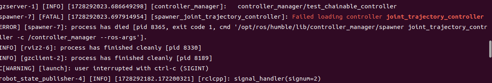
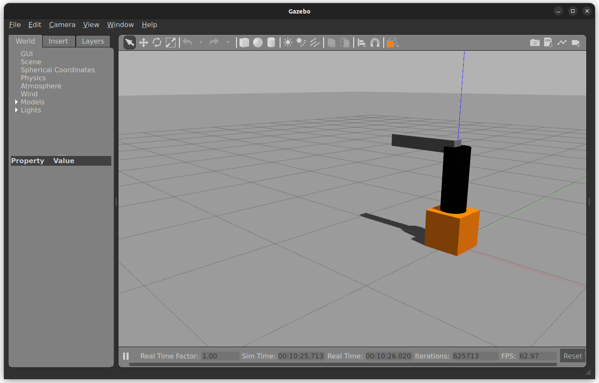
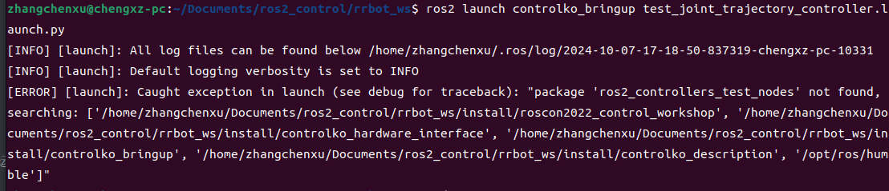
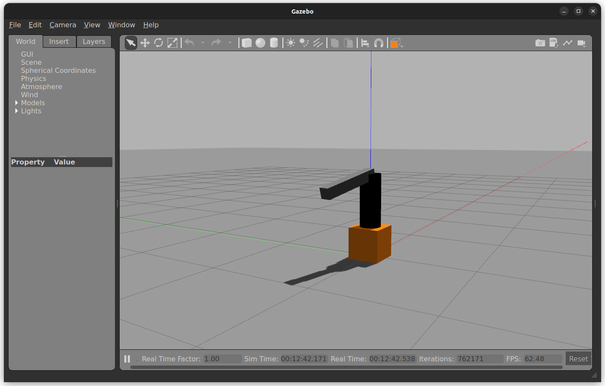
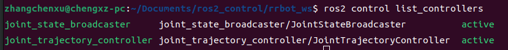
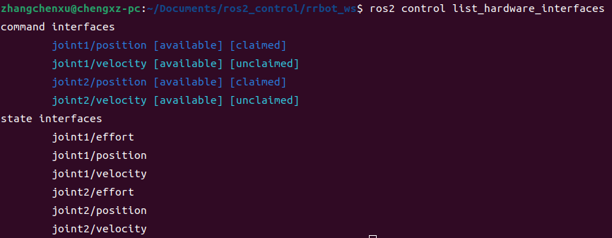

# 六、Ros2_contral

> 记录 RRBot 示例模型及控制环境的准备过程。

[← 返回总目录](../../README.md) · [↑ 返回本章目录](README.md) · [← 上一节：6-3 常用ros2_control标签](03-common-tags.md) · [下一节：6-5 Writing a new hardware interface →](05-new-hardware-interface.md)

---

## 6-4 准备rrbot

创建工作空间``rrcot_ws``

下载``https://github.com/ros-controls/roscon2022_workshop/tree/7-robot-hardware-interface/solution``中的项目

运行：

```bash
. install/setup.bash
ros2 launch controlko_bringup rrbot_sim_gazebo_classic.launch.py
```

可能



```bash
sudo apt-get install ros-kinetic-joint-trajectory-controller
```



之后运行

```bash
ros2 launch controlko_bringup test_joint_trajectory_controller.launch.py 
```

如果报错



安装：

```bash
sudo apt install ros-humble-ros2-controllers-test-nodes
```

模型开始运动：



第二个即是创建控制位置的控制器：



可在下图中看到``command interfaces``中有速度和位置，``interfaces``中有力、位置和速度


