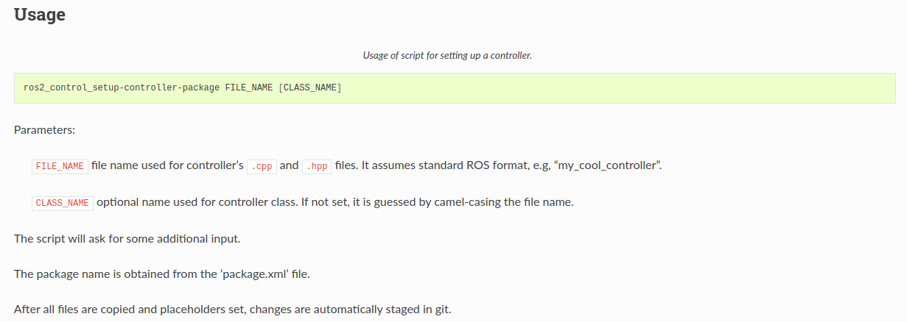

# 六、Ros2_contral

> 梳理自定义硬件接口的设计、实现与接入步骤。

[← 返回总目录](../../README.md) · [↑ 返回本章目录](README.md) · [← 上一节：6-4 准备rrbot](04-prepare-rrbot.md)

---

## 6-5 Writing a new hardware interface

官方文档：https://control.ros.org/master/doc/ros2_control/hardware_interface/doc/writing_new_hardware_component.html

下载一个模板：

```bash
git clone https://github.com/StoglRobotics/ros_team_workspace.git
```

**编写一个简单的硬件接口（hardware interface）**

首先创建一个新的工作空间

```bash
zhangchenxu@chengxz-pc:~/Documents/ros2_control/rrbot_ws/src$ ros2 pkg create my_hardware_interface --build-type ament_cmake 
```

打开文档

```bash
https://rtw.stoglrobotics.de/master/use-cases/ros2_control/setup_controller.html
```



下面这个命令是生成hardware interface模板的命令

```bash
ros2_control_setup-controller-package FILE_NAME [CLASS_NAME]
```

``FILE_NAME``：指定cpp文件名

``[CLASS_NAME]``：实际的类名

之后安装环境

```bash
zhangchenxu@chengxz-pc:~/Documents/ros2_control/rrbot_ws/src$ cd ..
zhangchenxu@chengxz-pc:~/Documents/ros2_control/rrbot_ws$ . install/setup.bash 
zhangchenxu@chengxz-pc:~/Documents/ros2_control/rrbot_ws$ cd ..
zhangchenxu@chengxz-pc:~/Documents/ros2_control$ cd ..
zhangchenxu@chengxz-pc:~/Documents$ cd ros
ros2_can/           ros2_mc/            ros2_ws/
ros2_control/       ros2_mcws/          ros_team_workspace/
zhangchenxu@chengxz-pc:~/Documents$ cd ros
ros2_can/           ros2_mc/            ros2_ws/
ros2_control/       ros2_mcws/          ros_team_workspace/
zhangchenxu@chengxz-pc:~/Documents$ cd ros_team_workspace/
zhangchenxu@chengxz-pc:~/Documents/ros_team_workspace$ . setup.bash 
zhangchenxu@chengxz-pc:~/Documents/ros_team_workspace$ cd ..
zhangchenxu@chengxz-pc:~/Documents$ cd ros2_control/rrbot_ws/
zhangchenxu@chengxz-pc:~/Documents/ros2_control/rrbot_ws$ cd src
zhangchenxu@chengxz-pc:~/Documents/ros2_control/rrbot_ws/src$ cd my_hardware_interface/
```

生成

```bash
zhangchenxu@chengxz-pc:~/Documents/ros2_control/rrbot_ws/src/my_hardware_interface$ ros2_control_setup-hardware-interface-package rrbot_harware_interface RRBotHardwareInterface

Which license-header do you want to use? [1]
(0) None
(1) Apache 2.0 License
(2) Proprietary
1
Insert your company or personal name (copyright): zhang
Which type of ros2_control hardware interface you want to extend? [0]
(0) system
(1) sensor
(2) actuator
0

ATTENTION: Setting up ros2_control hardware interface files with following parameters: file name 'rrbot_harware_interface', class 'RRBotHardwareInterface', package/namespace 'my_hardware_interface' for interface type 'system'. Those will be placed in folder '/home/zhangchenxu/Documents/ros2_control/rrbot_ws/src/my_hardware_interface'.

If correct press <ENTER>, otherwise <CTRL>+C and start the script again from the package folder and/or with correct robot name.

Template files copied.

Template files were adjusted.
fatal: 不是 git 仓库（或者任何父目录）：.git
Can not compile: No ROS_WS variable set. Trying to guess by sourced workspace.
Is "/home/zhangchenxu/Documents/ros2_control/rrbot_ws the correct sourced workspace? [yes no]
yes
Starting >>> my_hardware_interface
Finished <<< my_hardware_interface [5.32s]                     

Summary: 1 package finished [5.66s]
/home/zhangchenxu/Documents/ros2_control/rrbot_ws
Starting >>> my_hardware_interface
--- stderr: my_hardware_interface                   
Errors while running CTest
Output from these tests are in: /home/zhangchenxu/Documents/ros2_control/rrbot_ws/build/my_hardware_interface/Testing/Temporary/LastTest.log
Use "--rerun-failed --output-on-failure" to re-run the failed cases verbosely.
---
Finished <<< my_hardware_interface [3.63s]	[ with test failures ]

Summary: 1 package finished [3.86s]
  1 package had stderr output: my_hardware_interface
  1 package had test failures: my_hardware_interface
/home/zhangchenxu/Documents/ros2_control/rrbot_ws
build/my_hardware_interface/Testing/20241009-1154/Test.xml: 5 tests, 0 errors, 1 failure, 0 skipped
build/my_hardware_interface/test_results/my_hardware_interface/cppcheck.xunit.xml: 4 tests, 0 errors, 0 failures, 4 skipped
build/my_hardware_interface/test_results/my_hardware_interface/lint_cmake.xunit.xml: 1 test, 0 errors, 0 failures, 0 skipped
build/my_hardware_interface/test_results/my_hardware_interface/test_rrbot_harware_interface.gtest.xml: 1 test, 0 errors, 0 failures, 0 skipped
build/my_hardware_interface/test_results/my_hardware_interface/uncrustify.xunit.xml: 4 tests, 0 errors, 2 failures, 0 skipped
build/my_hardware_interface/test_results/my_hardware_interface/xmllint.xunit.xml: 2 tests, 0 errors, 0 failures, 0 skipped

FINISHED: Your package is set and the tests should be finished without any errors. (linter errors possible!)

```
