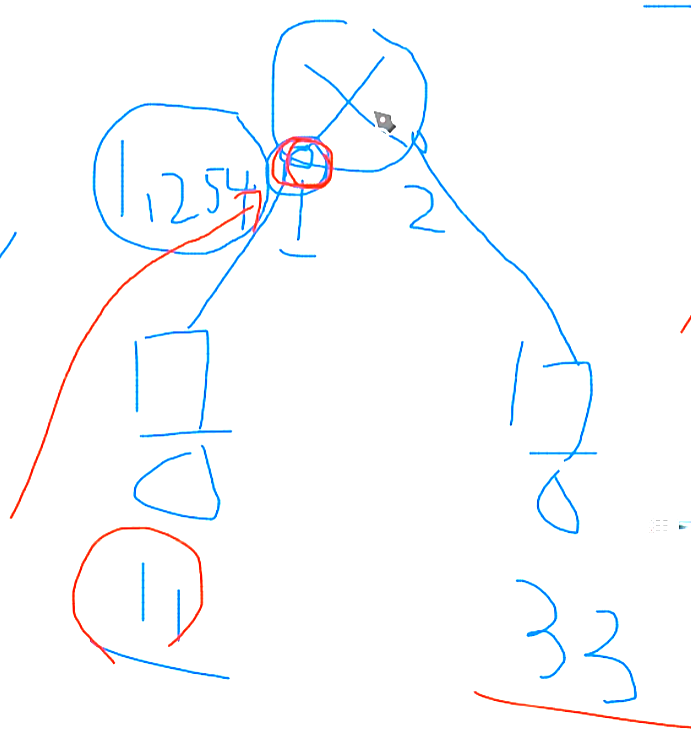
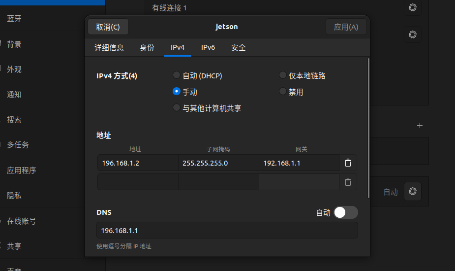
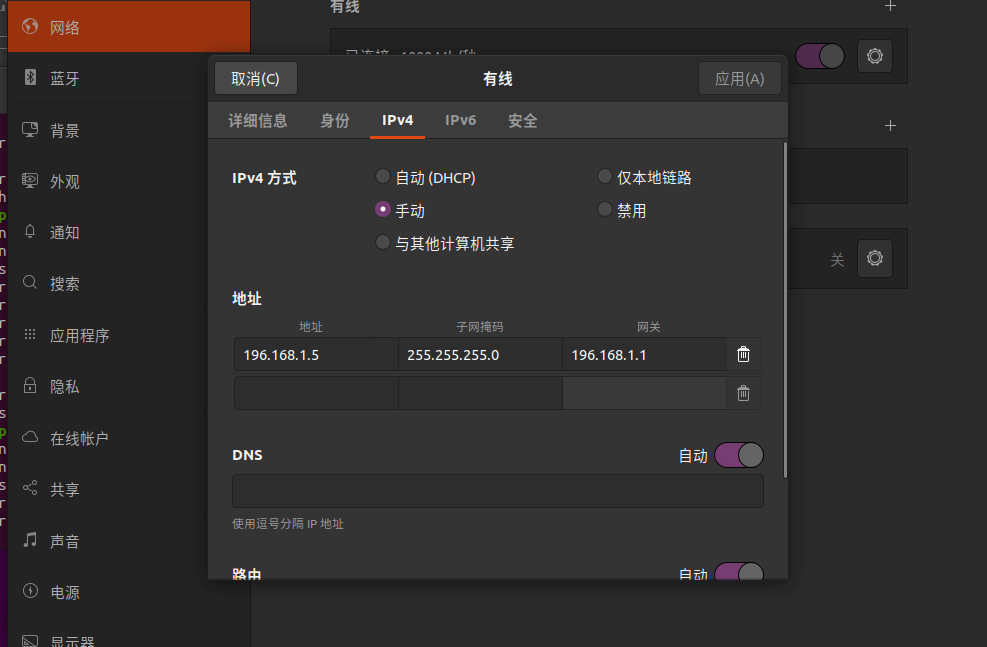
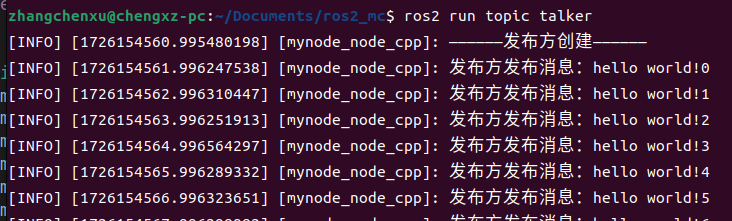
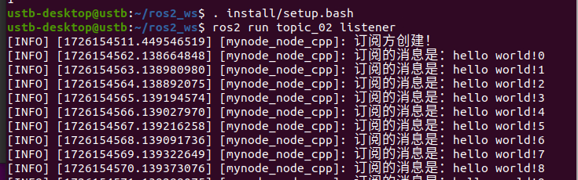
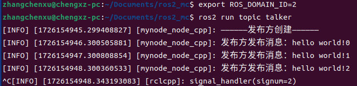
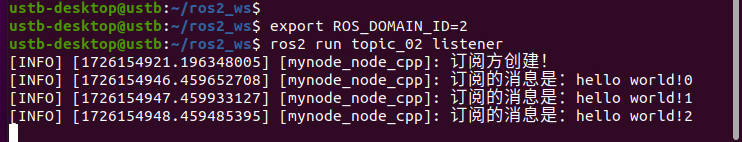

# 附录

> 说明 IP 地址、子网掩码、网段判断及 ROS 2 多机通信配置。

[← 返回总目录](../../README.md) · [↑ 返回本章目录](README.md) · [← 上一节：附录四 Can通讯](04-can-communication.md) · [下一节：附录六 传感器的使用 →](06-sensors.md)

---

## 附录五 什么是ip地址？子关掩码？ip地址段

形式是``x.x.x.x``，每个数字的范围是0-255

即范围是0.0.0.0 - 255.255.255.255

**子网掩码，默认网关。DNS都是干什么的**

``子网掩码``:

划分网段

Ip地址也分段，如何判断访问的目标ip是否同网段？看网络位，ip地址的前多少位是判断该ip在哪个网段。

如：ip:``192.268.1.1`` 和 掩码：`` 255.255.255.0``

从掩码可以看出前三位是网络位，及192.268.1.2也与上述ip同网段

掩码的作用是确认一个ip所在的网段，有了掩码就知道了网络位，进而判断ip间是否同网段


``默认网关``:

访问目标时，访问同网段目标，用一种通信方式，访问不同网段的目标，用另一种通信方式

**访问同网段目标**：直接发数据包--直接通讯

**访问不同网段的目标**：必须找中间人，由中间人做数据转发。中间人即网关（路由器）。 

​								路由功能：帮助不同网段进行数据转发功能



``DNS``：

将域名解析成ip

网址既是域名，但实际上域名均是ip地址

DNS可以实现通过域名来访问服务器

实际使用中需要一个服务器来将域名解析成为ip地址，这个服务器的ip地址既是DNS服务器的地址

### |-5-1 ROS2设备间的多机有线通讯

首先需要保证设备处于同一局域网下，且需要处于同一网段下（网络位相同且子网掩码一致）

首先将一台设备的Ip地址设置成如下形式：



另一台设备的Ip地址需按照其网络位及子网掩码进行相同配置



此时两机间便可以进行通讯





如果在同一局域网中存在多台运行ROS2的设备，且并不希望计算机之间存在干扰，需要通过配置各自的域ID实现

不同的DOMAIN ID之间是通过不同端口进行组播发现，由于端口数量有限，因此DOMAIN ID的安全范围在**0~101**之间（默认为0）

通过DOMAIN ID实现隔离：





因此需要配置

```shell
export ROS_DOMAIN_ID=2
```

来实现通过DOMAIN ID实现隔离的作用


### |-5-2 ROS2设备间的多机无线通讯

需要通过路由设备实现，大致内容同有线通讯，但网关需要配置为路由所对应的设备ip。
