# 附录

> 记录在 Qt 中搭建 ROS 2 框架、设计 IMU 界面与实现多线程的方法。

[← 返回总目录](../../README.md) · [↑ 返回本章目录](README.md) · [← 上一节：附录七 N100 IMU的使用](07-n100-imu.md) · [下一节：附录八 以ROS2作为上位机控制STM32 →](08-ros2-stm32.md)

---

## 附录七 为IMU的ROS项目设计QT界面

**需要的学习知识:**1、QT自定义消息；2：QT多线程。

**教程推荐：**

	<iframe src="//player.bilibili.com/player.html?isOutside=true&aid=782930587&bvid=BV1g24y1F7X4&cid=1110670698&p=56" scrolling="no" border="0" frameborder="no" framespacing="0" allowfullscreen="true"></iframe>
	<iframe src="//player.bilibili.com/player.html?isOutside=true&aid=813323036&bvid=BV1N34y1H7x7&cid=771797309&p=14" scrolling="no" border="0" frameborder="no" framespacing="0" allowfullscreen="true"></iframe>；
	<iframe src="//player.bilibili.com/player.html?isOutside=true&aid=813323036&bvid=BV1N34y1H7x7&cid=771797708&p=13" scrolling="no" border="0" frameborder="no" framespacing="0" allowfullscreen="true"></iframe>


首先需要安装并启用``ROSProjectManager``插件

### |-7-1 **在QT中建立ROS2框架**

新建一个文件夹用来放项目文件

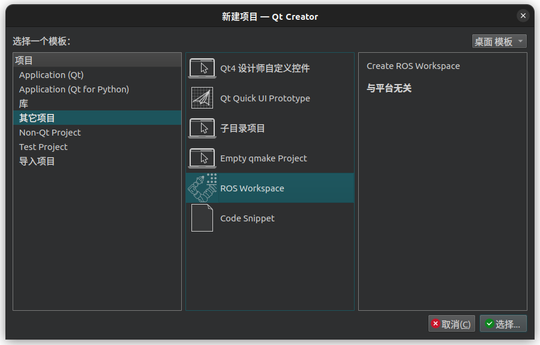

注意build system选择colcon

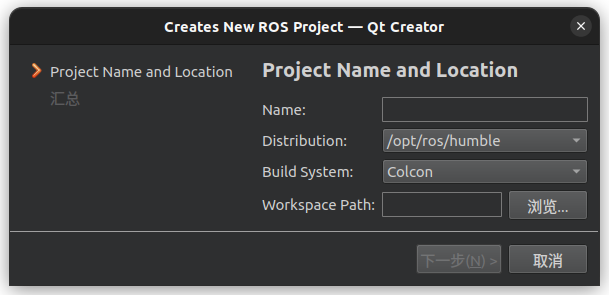

右键选中，构建一次，如果没有``src``文件，在过滤树形视图中设置显示空文件夹


之后将上文中ROS2项目中``src``目录下的文件均复制到QT项目中，项目结构如下所示

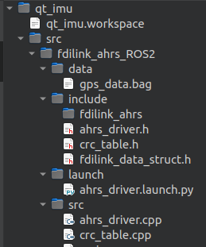

此时可以尝试在QT中选中编译，如何之前ROS2的项目没有问题，此处编译也不会出现问题（下图提示没有用到某些变量，再次编译即可消除）

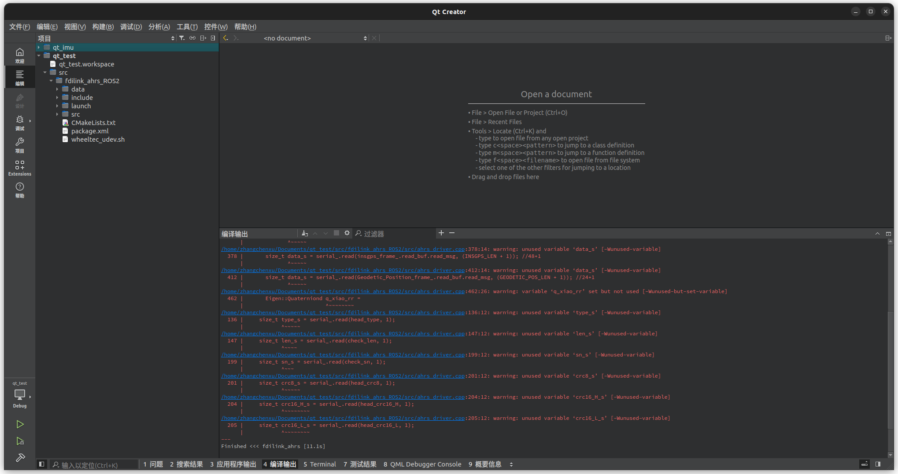

### |-7-2 **在QT中创建UI**

在``src``上右键，添加新文件，选Qt设计师界面类->选则MainWindow

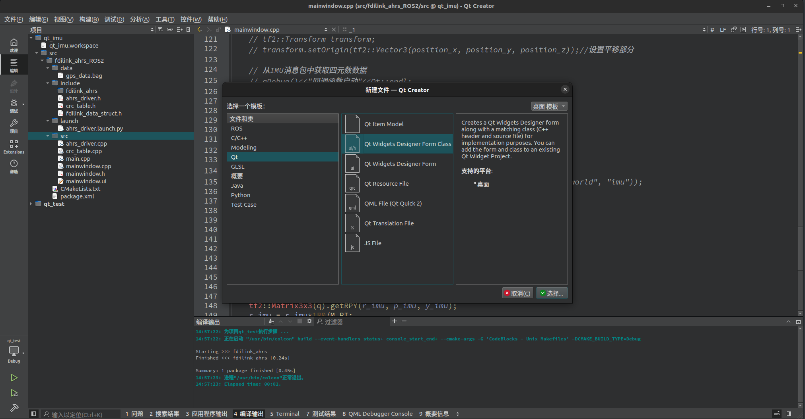

在``src``目录中手动添加``main.cpp``，其内容如下

``main.cpp``:

```cpp
#include "mainwindow.h"
#include <Eigen/Eigen>
#include <QApplication>
#include <ahrs_driver.h>
#include <rclcpp/rclcpp.hpp>

int main(int argc, char *argv[]) {   
  QApplication a(argc, argv);
  rclcpp::init(argc, argv);
  MainWindow w;
  w.show();
  return a.exec();
}
```

删除``ahrs_driver.cpp``中入口

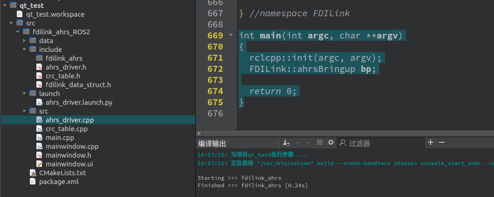

由于后续内容用不到以``imu_tf``开头的launch文件和cpp文件，可以删除，CMakelists中也需要排除编译这两个文件，后面会提到这一点

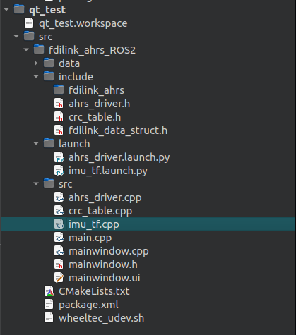

此时的文件目录如下：

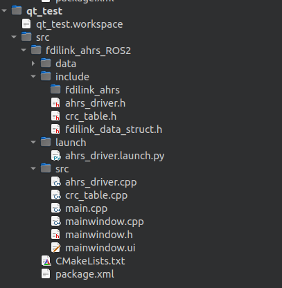

### |-7-3 **修改CMakeLists.txt**

需要修改的内容：

```cmake
#----添加的内容-----
find_package(Qt5  REQUIRED COMPONENTS  Widgets)
set(CMAKE_AUTOMOC ON)
set(CMAKE_AUTOUIC ON)
set(CMAKE_INCLUDE_CURRENT_DIR ON)
#-----------------
```

```cmake
# ———————添加的内容--------
add_executable(ahrs_driver_node
    src/ahrs_driver.cpp
    src/crc_table.cpp
    src/main.cpp
    src/mainwindow.ui
    src/mainwindow.h
    src/mainwindow.cpp
)
# -----------------------
```

```cmake
# ----------增加的内容---------
target_link_libraries(ahrs_driver_node Qt5::Widgets)
# ---------------------------
```

```cmake
# ------删除的内容------
# add_executable(imu_tf_node src/imu_tf.cpp)
# ament_target_dependencies(imu_tf_node rclcpp rclpy std_msgs sensor_msgs serial tf2_ros tf2 tf2_geometry_msgs)
# --------------------
```

```cmake
# ---------删除了imu_tf_node-------
install(TARGETS
  ahrs_driver_node
  DESTINATION lib/${PROJECT_NAME}
)
# --------------------------------
```

整体``CMakeLists.txt``文件如下

```cmake
cmake_minimum_required(VERSION 3.5)
project(fdilink_ahrs)


# Default to C99
if(NOT CMAKE_C_STANDARD)
  set(CMAKE_C_STANDARD 99)
endif()

# Default to C++14
if(NOT CMAKE_CXX_STANDARD)
  set(CMAKE_CXX_STANDARD 14)
endif()

if(CMAKE_COMPILER_IS_GNUCXX OR CMAKE_CXX_COMPILER_ID MATCHES "Clang")
  add_compile_options(-Wall -Wextra -Wpedantic)
endif()

find_package(Eigen3 REQUIRED)
set(Eigen3_INCLUDE_DIRS ${EIGEN3_INCLUDE_DIR})

# find dependencies
find_package(ament_cmake REQUIRED)
find_package(rclcpp REQUIRED)
find_package(rclpy REQUIRED)
find_package(sensor_msgs REQUIRED)
find_package(std_msgs REQUIRED)
find_package(tf2 REQUIRED)
find_package(tf2_ros REQUIRED)
find_package(serial REQUIRED)
find_package(nav_msgs REQUIRED)
find_package(geometry_msgs REQUIRED)
find_package(tf2_geometry_msgs REQUIRED)

#----添加的内容-----
find_package(Qt5  REQUIRED COMPONENTS  Widgets)
set(CMAKE_AUTOMOC ON)
set(CMAKE_AUTOUIC ON)
set(CMAKE_INCLUDE_CURRENT_DIR ON)
#-----------------


if(BUILD_TESTING)
  find_package(ament_lint_auto REQUIRED)
  # the following line skips the linter which checks for copyrights
  # uncomment the line when a copyright and license is not present in all source files
  #set(ament_cmake_copyright_FOUND TRUE)
  # the following line skips cpplint (only works in a git repo)
  # uncomment the line when this package is not in a git repo
  #set(ament_cmake_cpplint_FOUND TRUE)
  ament_lint_auto_find_test_dependencies()
endif()

include_directories(
  include
  src
  ${catkin_INCLUDE_DIRS}
  ${Eigen3_INCLUDE_DIRS} 
)

# ———————添加的内容--------
add_executable(ahrs_driver_node
    src/ahrs_driver.cpp
    src/crc_table.cpp
    src/main.cpp
    src/mainwindow.ui
    src/mainwindow.h
    src/mainwindow.cpp
)
# -----------------------

ament_target_dependencies(ahrs_driver_node rclcpp rclpy  std_msgs  sensor_msgs  serial tf2_ros tf2 nav_msgs geometry_msgs)

# ----------增加的内容---------
target_link_libraries(ahrs_driver_node Qt5::Widgets)
# ---------------------------

# ------删除的内容------
# add_executable(imu_tf_node src/imu_tf.cpp)
# ament_target_dependencies(imu_tf_node rclcpp rclpy std_msgs sensor_msgs serial tf2_ros tf2 tf2_geometry_msgs)
# --------------------


# find_package(Boost 1.55.0 REQUIRED COMPONENTS system filesystem)
# include_directories(ahrs_driver_node ${Boost_INCLOUDE_DIRS})
# link_directories(ahrs_driver_node ${Boost_LIBRARY_DIRS})
# target_link_libraries(ahrs_driver_node ${Boost_LIBRSRIES}

# ---------删除了imu_tf_node-------
install(TARGETS
  ahrs_driver_node
  DESTINATION lib/${PROJECT_NAME}
)
# --------------------------------

install(
  DIRECTORY launch 
  DESTINATION share/${PROJECT_NAME}
)

ament_package()

```


编译运行后会提示需要一个可执行程序

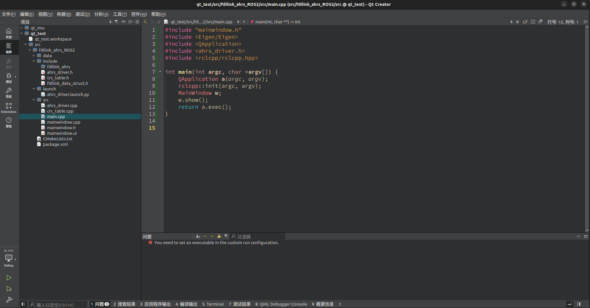

从CMakeLists.txt中可知，其生成的install文件在``/lib``中,在执行档中选中对应文件

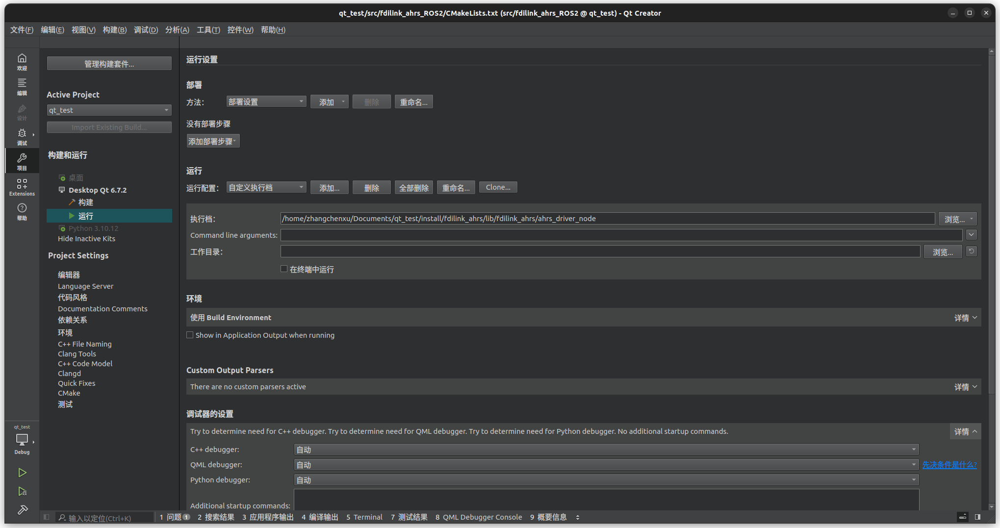

再次运行可以弹出UI窗口

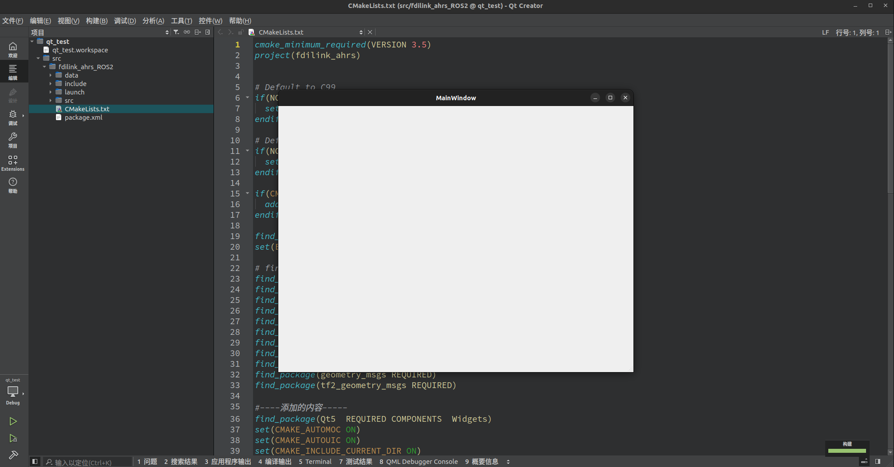

### |-7-4 UI初步设计

如果想达到一个按钮具有按下和释放均有执行，需要勾选属性中``checkable``选项

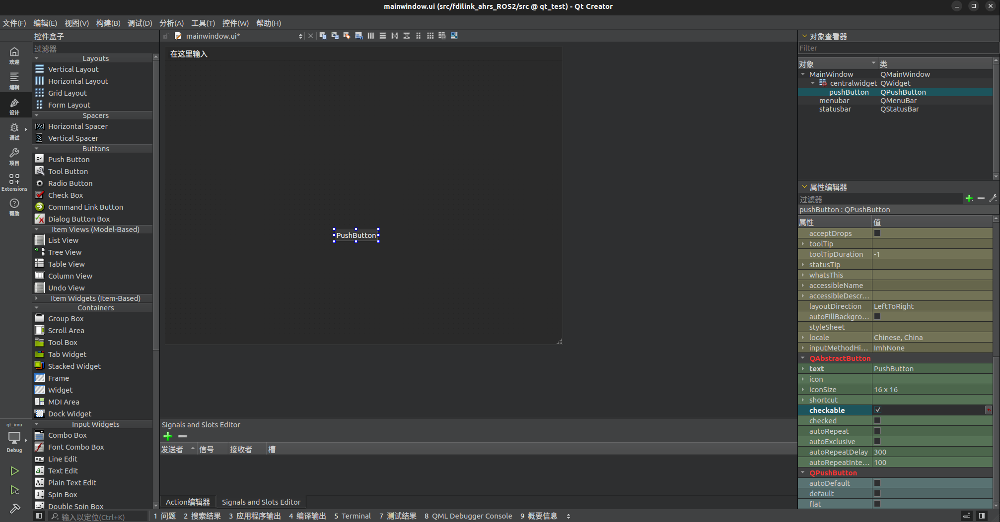

在``mainwindow.h``中添加头文件,同时定义pushbotton，及pushButton的槽函数

```cpp
#ifndef MAINWINDOW_H
#define MAINWINDOW_H

#include <QMainWindow>
#include <QtWidgets/QPushButton>

namespace Ui {
class MainWindow;
}

class MainWindow : public QMainWindow
{
    Q_OBJECT

public:
    explicit MainWindow(QWidget *parent = nullptr);
    ~MainWindow();
    // 定义pushButton
    QPushButton pushButton;

private:
    Ui::MainWindow *ui;
    
public slots:
    // pushButton的槽函数
    void On_allSelectBtnSlot();
};

#endif // MAINWINDOW_H
```

之后修改``mainwindow.cpp``文件,将槽函数On_allSelectBtnSlot与pushButton连接,并定义On_allSelectBtnSlot具体实现内容

```cpp
#include "mainwindow.h"
#include "ui_mainwindow.h"

MainWindow::MainWindow(QWidget *parent)
    : QMainWindow(parent)
    , ui(new Ui::MainWindow)
{
    ui->setupUi(this);
    // 将槽函数On_allSelectBtnSlot与pushButton连接
    connect(ui->pushButton,SIGNAL(clicked(bool)),this,SLOT(On_allSelectBtnSlot()));
}

MainWindow::~MainWindow()
{
    delete ui;
}
void MainWindow::On_allSelectBtnSlot()
{
    if(ui->pushButton->isChecked())
    {
        // 点击按钮时执行的功能代码
    }
    else
    {
        // 释放按钮时执行的功能代码
    }
}

```

### |-7-5 QT多线程实现

使用多线程的原因：

在ROS2中，`spin`函数的作用是保持节点的运行状态，处理回调函数和事件。具体来说，`spin`函数会进入一个循环，不断检查并调用节点的回调函数，以响应订阅的消息、服务请求等。因此，在主线程执行spin的时候会阻塞，所以通过多线程解决这个问题。

如何设置QT多线程可以在教程中学习，同时此处需要注意的问题有：

1、在其他线程中无法调用UI中的函数，通过继承的方式也不行，因此如果需要将线程中的数据传送到UI界面中，需要使用``自定义信号``来实现，大概来讲就是在其他线程中使用 ``emit()``函数，通过信号槽将数据传出，再通过信号槽将数据显示在ui中；

参考教程：https://www.bilibili.com/video/BV1N34y1H7x7?t=0.6&p=14

2、rclcpp：：init（）与rclcpp：：shutdown（）成对出现，避免重复[初始化](https://so.csdn.net/so/search?q=初始化&spm=1001.2101.3001.7020)以及重复关闭情况；

3、``PI``的定义可能会与一些系统库冲突，如果出现，则将``ahrs_driver.h``中的PI的定义改一下；

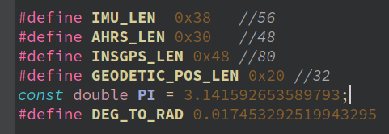

4、``setText``只能显示字符串，需要转换格式；

另附完整代码文件：

``main.cpp``

```cpp
#include "mainwindow.h"
#include <Eigen/Eigen>
#include <QApplication>
#include <ahrs_driver.h>
#include <rclcpp/rclcpp.hpp>

int main(int argc, char *argv[]) {   
  QApplication a(argc, argv);
  MainWindow w;
  w.show();
  return a.exec();
}
```


``mainwindow.cpp``

```cpp
#include "mainwindow.h"
#include "ui_mainwindow.h"
#include <QDebug>
#include <ahrs_driver.h>
#include <Eigen/Eigen>
#include <rclcpp/rclcpp.hpp>

#include <memory>
#include <inttypes.h>
#include <rclcpp/rclcpp.hpp>
#include <sensor_msgs/msg/imu.hpp>
#include <tf2_ros/transform_broadcaster.h>
#include <tf2_geometry_msgs/tf2_geometry_msgs.hpp>
#include <tf2/LinearMath/Transform.h>
#include <tf2/LinearMath/Quaternion.h>
#include <string>
#include <geometry_msgs/msg/transform_stamped.hpp>
#include <rclcpp/time.hpp>
#include <QWidget>

using std::placeholders::_1;
int position_x;
int position_y;
int position_z;
double r_imu, p_imu, y_imu;

MainWindow::MainWindow(QWidget *parent)
    : QMainWindow(parent)
    , ui(new Ui::MainWindow)
{
    // 开启UI界面
    ui->setupUi(this);
    // 设置imu的输出框无光标且只读
    ui->lineEdit->setStyleSheet("QLineEdit {}");
    ui->lineEdit->setReadOnly(true);
    ui->lineEdit_p->setStyleSheet("QLineEdit {}");
    ui->lineEdit_p->setReadOnly(true);
    ui->lineEdit_y->setStyleSheet("QLineEdit {}");
    ui->lineEdit_y->setReadOnly(true);

    qDebug()<<"读数线程开启!!!"<<Qt::endl;
    // 开启读数线程
    imu_data_Thread = new imu_data_thread(this);
    imu_data_Thread->start();
    // 开启IMU广播线程
    imu_br_Thread = new imu_br_thread(this);

    connect(imu_data_Thread,&imu_data_thread::Data,this,&MainWindow::display_imu);
    connect(ui->pushButton,SIGNAL(clicked(bool)),this,SLOT(On_allSelectBtnSlot()));
}

MainWindow::~MainWindow()
{
    delete ui;
    rclcpp::shutdown();
}

//------------------------------------------------------------------------------------//

void MainWindow::On_allSelectBtnSlot()
{
    if(ui->pushButton->isChecked())
    {

        qDebug()<<"----------IMU使能----------"<<Qt::endl;
        // 开启线程
        imu_br_Thread->start();
    }
    else
    {
        qDebug()<<"----------IMU关闭----------"<<Qt::endl;
        // 关闭线程
        imu_br_Thread->terminate();
        // 清空lineedit中显示的数据
        ui->lineEdit->clear();
        ui->lineEdit_p->clear();
        ui->lineEdit_y->clear();
    }
}

// 开启IMU广播线程任务
void imu_br_thread::run()
{
    qDebug() << "IMU Broadcast Thread Running"<<Qt::endl;
    FDILink::ahrsBringup bp;
}

// 开启读数线程任务
void imu_data_thread::run()
{
    qDebug()<<"读数线程开启"<<Qt::endl;


    int argc=0;
    char **argv=NULL;
    rclcpp::init(argc,argv);
    node=rclcpp::Node::make_shared("imu_data_to_tf");
    sub_ = node->create_subscription<sensor_msgs::msg::Imu>("imu", 10, std::bind(&imu_data_thread::ImuCallback,this, _1));
    RCLCPP_INFO(node->get_logger(), "读数初始化完成");
    rclcpp::spin(node);
    rclcpp::shutdown();
    qDebug()<<"节点关闭"<<Qt::endl;


}


// 读数线程任务回调函数
void imu_data_thread::ImuCallback(const sensor_msgs::msg::Imu::SharedPtr imu_data){

    // static tf2_ros::TransformBroadcaster br;//广播器

    // tf2::Transform transform;
    // transform.setOrigin(tf2::Vector3(position_x, position_y, position_z));//设置平移部分

    // 从IMU消息包中获取四元数数据
    // qDebug()<<"回调函数启动"<<Qt::endl;
    tf2::Quaternion q;
    q.setX(imu_data->orientation.x);
    q.setY(imu_data->orientation.y);
    q.setZ(imu_data->orientation.z);
    q.setW(imu_data->orientation.w);
    q.normalized(); // 归一化

    // transform.setRotation(q);//设置旋转部分
    // 广播出去
    // br.sendTransform(tf::StampedTransform(transform, ros::Time::now(), "world", "imu"));
    geometry_msgs::msg::TransformStamped tfs;
    tfs.header.stamp = rclcpp::Clock().now();
    tfs.header.frame_id = "world";
    tfs.child_frame_id = "imu";
    tfs.transform.translation.x = position_x;
    tfs.transform.translation.y = position_y;
    tfs.transform.translation.z = position_z;
    tfs.transform.rotation.x = q.getX();
    tfs.transform.rotation.y = q.getY();
    tfs.transform.rotation.z = q.getZ();
    tfs.transform.rotation.w = q.getW();

    tf2::Matrix3x3(q).getRPY(r_imu, p_imu, y_imu);
    r_imu = r_imu*180/M_PI;
    p_imu = p_imu*180/M_PI;
    y_imu = y_imu*180/M_PI;

    RCLCPP_INFO(node->get_logger(), "滚转：%.2f-----俯仰：%.2f-----偏航：%.2f-----", r_imu,p_imu,y_imu);
    // 通过信号槽将信号传出
    emit Data(r_imu,p_imu,y_imu);
}

// 将信号槽中的数据显示至Ui中
void MainWindow::display_imu(double dis_r,double dis_p,double dis_y){

    ui->lineEdit->setText(QString::number(dis_r));
    ui->lineEdit_p->setText(QString::number(dis_p));
    ui->lineEdit_y->setText(QString::number(dis_y));
}
```


``main.h``

```cpp
#ifndef MAINWINDOW_H
#define MAINWINDOW_H

#include <QDebug>
#include <QMainWindow>
#include <QThread>
#include <QWidget>
#include <QtWidgets/QPushButton>

#include <rclcpp/rclcpp.hpp>
#include <sensor_msgs/msg/imu.hpp>
// #include "std_msgs/msg/string.hpp"

// 两个线程类的声明
class imu_data_thread;
class imu_br_thread;

namespace Ui {
class MainWindow;
}

class MainWindow : public QMainWindow {
  Q_OBJECT

public:
  explicit MainWindow(QWidget *parent = nullptr);
  ~MainWindow();
  QPushButton pushButton;

public slots:
  // pushButton的槽函数
  void On_allSelectBtnSlot();
  // imu信号
  void display_imu(double dis_r, double dis_p, double dis_y);

private:
  Ui::MainWindow *ui;
  imu_data_thread *imu_data_Thread;
  imu_br_thread *imu_br_Thread;
};

// 订阅线程
class imu_data_thread : public QThread {
  Q_OBJECT
public:
  rclcpp::Subscription<sensor_msgs::msg::Imu>::SharedPtr sub_;
  std::shared_ptr<rclcpp::Node> node;
  void ImuCallback(const sensor_msgs::msg::Imu::SharedPtr imu_data);

  imu_data_thread(QWidget *parent = nullptr) { Q_UNUSED(parent) };
  ~imu_data_thread() {}

  void run();

signals:
  void Data(double r_data, double p_data, double y_data);
};

// 广播线程
class imu_br_thread : public QThread {
  Q_OBJECT
public:
  imu_br_thread(QWidget *parent = nullptr) { Q_UNUSED(parent) };
  ~imu_br_thread() {}
  void run();
};

#endif // MAINWINDOW_H

```


**效果展示：**

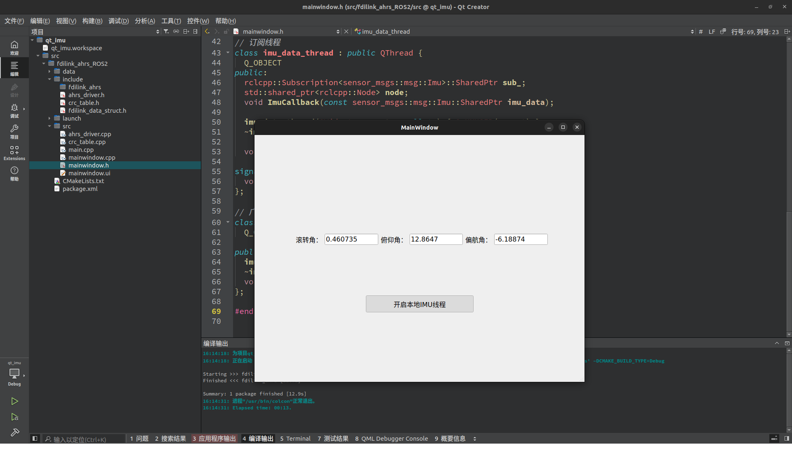
