# 附录

> 介绍 N100 IMU 的驱动安装、数据订阅与可视化流程。

[← 返回总目录](../../README.md) · [↑ 返回本章目录](README.md) · [← 上一节：附录六 传感器的使用](06-sensors.md) · [下一节：附录七 为IMU的ROS项目设计QT界面 →](07-imu-qt-interface.md)

---

## 附录七 N100 IMU的使用

### |-7-0 Serial库的安装

Linux 中一般不需要安装 CP2102 的驱动和 CH9102 的驱动，CH9102 设备别名时用 ttyACM 开头的设备直接别名。

如果使用IMU的串口进行通讯，由于ros2中没有集成serial库，因此需要自己下载源码进行编译安装。

首先使用下面获取

```shell
git clone https://github.com/jinmenglei/serial_ros2
```

之后创建``build``文件夹

```shell
cd build
cmake ..
make
sudo make install 
```

之后将``fdilink_ahrs_ROS2``移动至工作空间的``src``下，在工作空间下进行编译


直接运行可能会出现以下问题

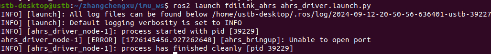

这是由于没有固定串口号导致的问题

解决方法为：

1、修改串口号

在 Windows 中需要把 WHEELTEC N 系列上的 CP2102 芯片串口号改为 0003，用 USB 线把惯导模块连接电脑，通过 CP21xxCustomizationUtility 这个 windows上的软件修改并固定,操作如下图：

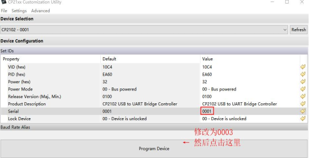

2、设备创建别名

设对应的串口名一般都是会变化的，为了避免手动选择，这里可以通过给USB 设备创建别名的方式解决。
WHEELTEC 通过脚本文件来为设备创建别名，WHEELTEC N 系列对应的串口号为 0003，对应 ATTRS{serial}=="0003"，脚本文件存放在【资料包\2.ROS_SDK\fdilink_ahrs_ROS1\fdilink_ahrs】文件夹下的 wheeltec_udev.sh 文件中：

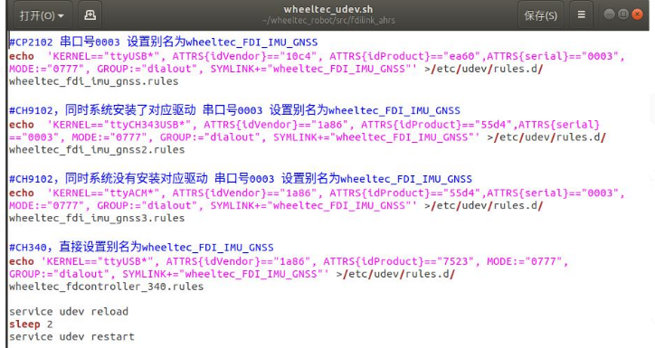

依次运行以下两个指令：

```shell
sudo chmod 777 wheeltec_udev.sh
sudo ./wheeltec_udev.sh
```

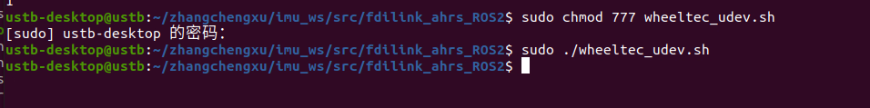

3、检查

把 WHEELTEC N100 模块连接到 ROS 主控，在终端运行：ll /dev 查看设备

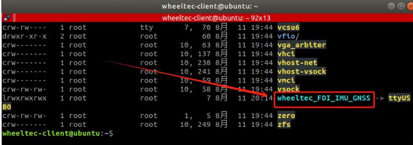

完成以上操作后重新插拔imu

之后编译

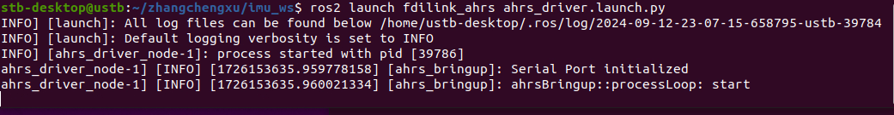

可以正常运行。

之后正常通过编译：


启用``Launch``文件

```shell
. install/setup.bash 
ros2 launch fdilink_ahrs ahrs_driver.launch.py
```

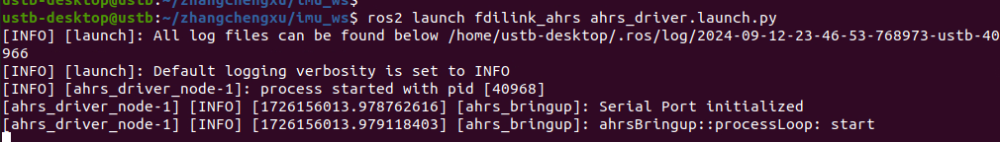

echo话题查看数据

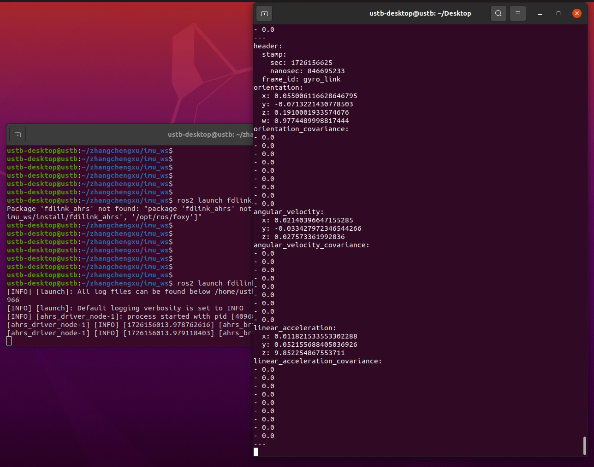

在新终端执行

```shell
ros2 topic echo imu
```

**补充：**其他用来管理和审查话题的工具和命令

1. **rqt_graph**: 这是一个图形化工具，用于可视化节点和话题以及它们之间的连接。您可以通过在终端中输入 `rqt_graph` 来运行它，或者通过 `rqt` 插件来访问。
2. **ros2 topic list**: 这个命令列出了当前活跃的所有话题。使用 `ros2 topic list -t` 可以显示每个话题的消息类型。
3. **ros2 topic echo**: 使用这个命令可以实时监听某个话题的消息流。例如，`ros2 topic echo /turtle1/cmd_vel` 将显示 `/turtle1/cmd_vel` 话题上的消息。
4. **ros2 topic info**: 这个命令显示某个特定话题的详细信息，包括其类型、发布者和订阅者列表。例如，`ros2 topic info /turtle1/cmd_vel`。
5. **ros2 interface show**: 这个命令用于查看消息类型的详细结构，例如 `ros2 interface show geometry_msgs/msg/Twist` 将显示 `Twist` 消息类型的结构。
6. **ros2 topic pub**: 这个命令允许您直接从命令行向话题发布消息。例如，`ros2 topic pub --once /turtle1/cmd_vel geometry_msgs/msg/Twist "{linear: {x: 2.0, y: 0.0, z: 0.0}, angular: {x: 0.0, y: 0.0, z: 1.8}}"` 将向 `/turtle1/cmd_vel` 话题发布一次消息。
7. **ros2 topic hz**: 使用这个命令可以监控并报告某个话题的消息发布频率。例如，`ros2 topic hz /turtle1/cmd_vel`。


### |-7-1 如何订阅IMU中的数据？

实际订阅并不需要走太多弯路，在提供的``ahrs_driver.cpp``文件中，已经创建好了``imu_pub``发布方

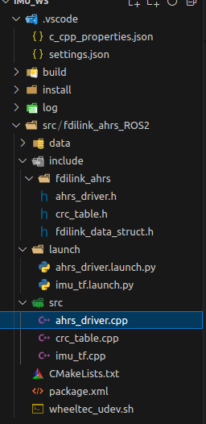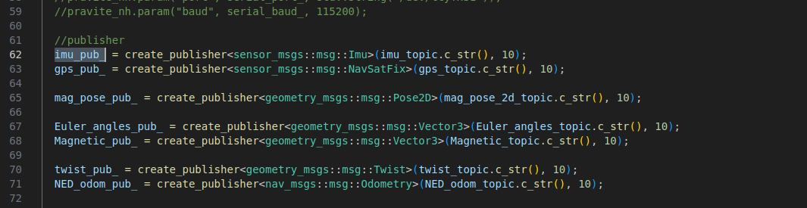

话题名称为``imu_topic``,因此只需要订阅这个话题便可以获取IMU的数据

订阅的过程可以修改``imu_tf.cpp``达到,在整个历程中，有很多参数服务器，个人推测应该是为了提高代码移植性，以及方便通过参数服务器修改对应参数而设计的。

```cpp
#include <memory>
#include <inttypes.h>
#include <rclcpp/rclcpp.hpp>
#include <sensor_msgs/msg/imu.hpp>
#include <tf2_ros/transform_broadcaster.h>
#include <tf2_geometry_msgs/tf2_geometry_msgs.hpp>
#include <tf2/LinearMath/Transform.h>
#include <tf2/LinearMath/Quaternion.h>
#include <string>
#include <geometry_msgs/msg/transform_stamped.hpp>
#include <rclcpp/time.hpp>
using std::placeholders::_1;
using namespace std;

/* 参考ROS wiki
 * http://wiki.ros.org/tf/Tutorials/Writing%20a%20tf%20broadcaster%20%28C%2B%2B%29
 * */

int position_x;
int position_y;
int position_z;
std::string imu_topic;
std::string imu_frame_id, world_frame_id;

static std::shared_ptr<tf2_ros::TransformBroadcaster> br;
rclcpp::Node::SharedPtr nh_ = nullptr;
class imu_data_to_tf : public rclcpp::Node
{
public:
    imu_data_to_tf() : Node("imu_data_to_tf")
    {

        // node.param("/imu_tf/imu_topic", imu_topic, std::string("/imu"));
        // node.param("/imu_tf/position_x", position_x, 0);
        // node.param("/imu_tf/position_y", position_y, 0);
        // node.param("/imu_tf/position_z", position_z, 0);
        RCLCPP_INFO(this->get_logger(), "订阅方创建！");

        this->declare_parameter<std::string>("world_frame_id", "/world");
        this->get_parameter("world_frame_id", world_frame_id);

        this->declare_parameter<std::string>("imu_frame_id", "/imu");
        this->get_parameter("imu_frame_id", imu_frame_id);

        this->declare_parameter<std::string>("imu_topic", "/imu");
        this->get_parameter("imu_topic", imu_topic);

        this->declare_parameter<std::int16_t>("position_x", 1);
        this->get_parameter("position_x", position_x);

        this->declare_parameter<std::int16_t>("position_y", 1);
        this->get_parameter("position_y", position_y);

        this->declare_parameter<std::int16_t>("position_z", 1);
        this->get_parameter("position_z", position_z);
        // br = std::make_shared<tf2_ros::TransformBroadcaster>(this);
        sub_ = this->create_subscription<sensor_msgs::msg::Imu>(imu_topic.c_str(), 10, std::bind(&imu_data_to_tf::ImuCallback, this, _1));
    }

private:
    double r, p, y;
    rclcpp::Subscription<sensor_msgs::msg::Imu>::SharedPtr sub_;

    // rclcpp::Subscriber sub = node.subscribe(imu_topic.c_str(), 10, &ImuCallback);

    void ImuCallback(const sensor_msgs::msg::Imu::SharedPtr imu_data)
    {

        // static tf2_ros::TransformBroadcaster br;//广播器

        // tf2::Transform transform;
        // transform.setOrigin(tf2::Vector3(position_x, position_y, position_z));//设置平移部分

        // 从IMU消息包中获取四元数数据
        tf2::Quaternion q;
        q.setX(imu_data->orientation.x);
        q.setY(imu_data->orientation.y);
        q.setZ(imu_data->orientation.z);
        q.setW(imu_data->orientation.w);
        q.normalized(); // 归一化

        // transform.setRotation(q);//设置旋转部分
        // 广播出去
        // br.sendTransform(tf::StampedTransform(transform, ros::Time::now(), "world", "imu"));
        geometry_msgs::msg::TransformStamped tfs;
        tfs.header.stamp = rclcpp::Node::now();
        tfs.header.frame_id = "world";
        tfs.child_frame_id = "imu";
        tfs.transform.translation.x = position_x;
        tfs.transform.translation.y = position_y;
        tfs.transform.translation.z = position_z;
        tfs.transform.rotation.x = q.getX();
        tfs.transform.rotation.y = q.getY();
        tfs.transform.rotation.z = q.getZ();
        tfs.transform.rotation.w = q.getW();

        tf2::Matrix3x3(q).getRPY(r, p, y);
        r = r*180/M_PI;
        p = p*180/M_PI;
        y = y*180/M_PI;
        RCLCPP_INFO(this->get_logger(), "滚转：%.2f-----俯仰：%.2f-----偏航：%.2f", r,p,y);
        // br->sendTransform(tfs);
        // tf2::(transform, rclcpp::Node::now(), "world", "imu")
    }
};

int main(int argc, char **argv)
{
    rclcpp::init(argc, argv);

    // ros::NodeHandle node;, "imu_data_to_tf"
    auto node = std::make_shared<imu_data_to_tf>();
    rclcpp::spin(node);
    rclcpp::shutdown();
    return 0;
}
```

其中最为主要的是 97 行的转换函数，将四元数转换为RPY角。

```cpp
        double r, p, y;
//.....................................
        tf2::Matrix3x3(q).getRPY(r, p, y); // 将 q 转换为一个3×3的矩阵对象,调用getRPY(),将其转换为欧拉角
        r = r*180/M_PI;
        p = p*180/M_PI;
        y = y*180/M_PI;
        RCLCPP_INFO(this->get_logger(), "滚转：%.2f-----俯仰：%.2f-----偏航：%.2f", r,p,y);
```

启动

```bash
ros2 launch fdilink_ahrs ahrs_driver.launch.py
```

再启动

```bash
ros2 run fdilink_ahrs imu_tf_node
```

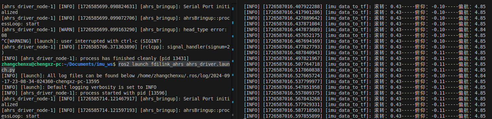

可以正常读数，关于偏航角，其 0 位置为IMU上电时的位置，具体可以参考手册中关于相对和绝对偏航角，以及 y角的设置


### |-7-2 如何可视化数据？

首先需要安装IMU的可视化工具，imu-tools

```bash
sudo apt install ros-humble-imu-tools
```

装完毕后，运行节点，并开启rviz2，点击`add`，在`By topic`中添加`Imu`

其中fix frame可以在topic中能看到，具体方式是*ros2 topic echo /imu*，就能看到frame_id，fixed frame替换即可。

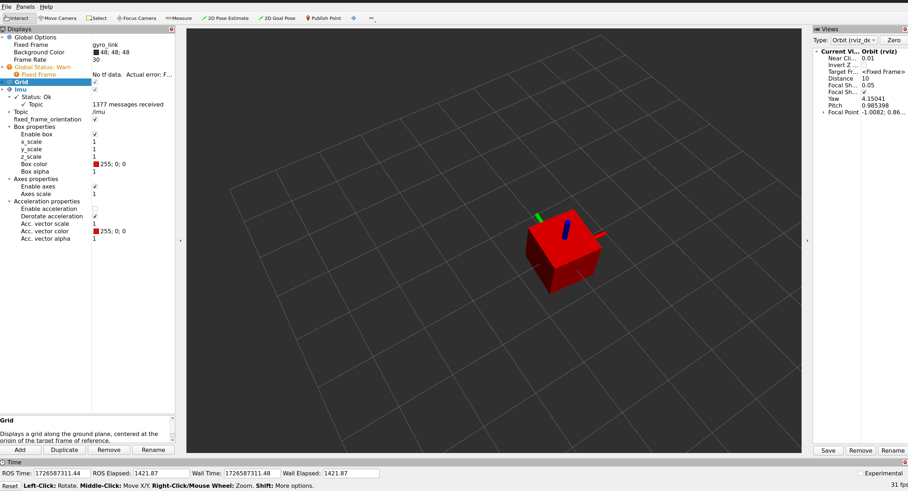

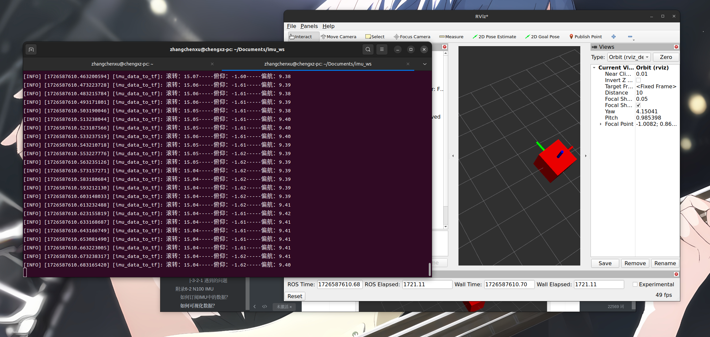
