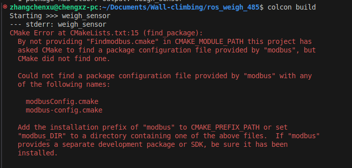

# 附录

> 说明 Modbus RS485 库的安装和基础使用方式。

[← 返回总目录](../../README.md) · [↑ 返回本章目录](README.md) · [← 上一节：附录八 以ROS2作为上位机控制STM32](08-ros2-stm32.md) · [下一节：附录十 在ROS2环境下使用相机设备 →](10-camera-devices.md)

---

## 附录九 ROS2中如何使用MODBUS RS485

### |-9-1 如何安装MODBUS RS485库

首先

```bash
sudo apt-get install libmodbus-dev
```

之后编译，肯会遇到以下错误



此时去查找``modbus.h``以及``libmodbus.so``相关文件的位置，之后在``/usr/lib/cmake``创建以下文件夹以及文件


内容如下，相对应的地址可以根据实际情况进行更改

```cmake
FIND_PATH(HIREDIS_INCLUDE_DIR modbus.h
          /usr/local/include
          /usr/include
          )
 
FIND_LIBRARY(MODBUS_LIBRARIES NAMES MODBUS
             PATHS
             /usr/local/lib
             /usr/lib
             /usr/lib/x86_64-linux-gnu
             )
```

### |-9-1 实际使用

实际使用可以参考串口通讯，但发送的信息一定要注意有**校验码**
