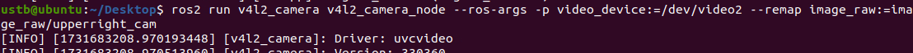
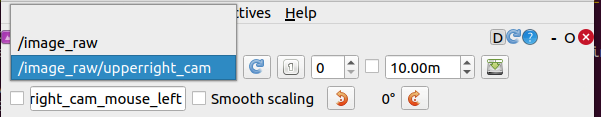
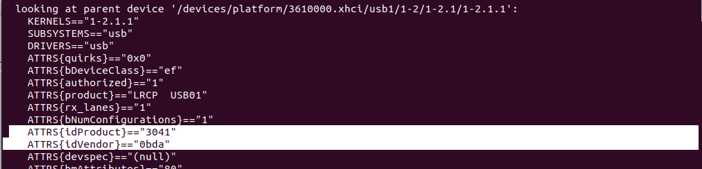
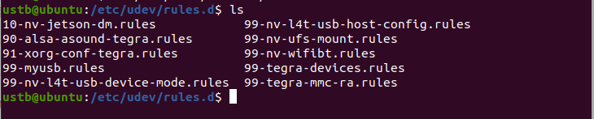

# 附录

> 整理相机设备选择、固定设备名称、设备 ID 获取与规则配置。

[← 返回总目录](../../README.md) · [↑ 返回本章目录](README.md) · [← 上一节：附录九 ROS2中如何使用MODBUS RS485](09-modbus-rs485.md)

---

## 附录十 在ROS2环境下使用相机设备

参考资料：

https://bingda.yuque.com/staff-hckvzc/ai5gkn/nu8kcf

https://zhuanlan.zhihu.com/p/517831485

### |-10-1 设备选择

在ROS中使用摄像头的前提是，摄像头在Linux系统下是可识别的，通常来说UVC协议的USB摄像头都可以正常使用，例如这一类。


大部分笔记本电脑自带的摄像头都是UVC协议的，所以也是可以直接使用的。

### |-10-2 如何固定摄像头名称

对于免驱的usb摄像头，其设备号一般可以刷写，这个功能可能需要于卖家沟通

#### |-10-2-1 设备名称

```bash
ls /dev
```

终端命令，确定有几个视频输入


可见有四个输入，而我只使用了两个摄像头，所以需要确认有效的输入。

在安装``v4l2_camera``后https://zhuanlan.zhihu.com/p/517831485，通过与``rqt``工具箱结合，确认有效输入，可能需要用到

```bash 
ros2 run v4l2_camera v4l2_camera_node --ros-args -p video_device:=/dev/video1
```

来选中设备，通过

```bash
ros2 run v4l2_camera v4l2_camera_node --ros-args --remap image_raw:=image_raw/upperright_cam
```

来重映射话题名称

对于我目前的设备，分别使用

```bash
ros2 run v4l2_camera v4l2_camera_node --ros-args -p video_device:=/dev/video0
```


以及

```bash
ros2 run v4l2_camera v4l2_camera_node --ros-args -p video_device:=/dev/video2 --remap image_raw:=image_raw/upperright_cam
```



可以在``rqt``工具箱中获取两个话题



#### |-10-2-2 获取设备ID

USB相机使用固定设备名称的方式，此外还有固定USB口名称的方式

https://blog.csdn.net/weixin_58198422/article/details/137474551

https://blog.csdn.net/qq_37280428/article/details/124960303

https://blog.csdn.net/HuangChen666/article/details/125626570

https://www.cnblogs.com/miaorn/p/14144854.html

使用下面这条命令获取

```bash
udevadm info -a -p /sys/class/video4linux/video0
```

往下翻到的第一个



这个获取方式也可以通过插拔设备，加``lsusb``命令的方式获取

#### |-10-2-3 编译规则

进入`/etc/udev/rules.d/`文件夹下



新建`video.rules`文件，文件内容如下：

```
KERNEL=="video*" , ATTRS{idVendor}== "0bda", ATTRS{idProduct}=="3041", ATTR{index}=="0",MODE:="0777", SYMLINK+="camera_1"
```

重启后执行

```bash
ls /dev/camera*
```


可以找到设备，使用

```bash 
ros2 run v4l2_camera v4l2_camera_node --ros-args -p video_device:=/dev/camera_1 
```

可以使用``rqt``获取视频数据。

#### |-10-2-4  应用

创建以下规则

```bash 
KERNEL=="video*" , ATTRS{idVendor}== "0bda", ATTRS{idProduct}=="3041", ATTR{index}=="0",MODE:="0777", SYMLINK+="camera_1"
KERNEL=="video*" , ATTRS{idVendor}== "0bda", ATTRS{idProduct}=="3042", ATTR{index}=="0",MODE:="0777", SYMLINK+="camera_2"
```

为重映射话题

```bash 
ros2 run v4l2_camera v4l2_camera_node --ros-args -p video_device:=/dev/camera_1 --remap image_raw:=image_raw/camera_1
```

``` bash 
ros2 run v4l2_camera v4l2_camera_node --ros-args -p video_device:=/dev/camera_2 --remap image_raw:=image_raw/camera_2
```


​
